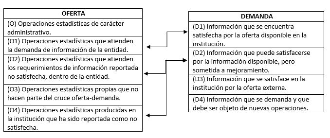

# Metodología

El presente Plan Estadístico tiene como objetivo ser un referente en términos de organización de
la actividad estadística de la entidad. Su elaboración y actualización continua permitirá conocer la
ubicación y características generales de la producción de información estadística estratégica, así
como las necesidades actuales y futuras, desde el punto de vista de los usuarios actuales y
potenciales de la misma. Es decir, en la medida en que se considera a la información como un activo de la organización, este trabajo permitirá establecer la oferta y demanda de este activo,
para identificar los desequilibrios y plantear un plan de corrección de los mismos, que permita
reducir o mitigar las asimetrías de información.

En tal sentido, el Plan Estadístico es producto de un proceso técnico y dinámico, que se debe
mantener en el tiempo como coordinador y gestor de la actividad estadística, de tal manera que
se garantice la coherencia, pertinencia, oportunidad, disponibilidad y accesibilidad de la
información estadística que la entidad requiere para el cumplimiento de su misión.

El Departamento Administrativo Nacional de Estadísticas (DANE) ha venido desarrollando un
conjunto de herramientas metodológicas, que facilitan conceptualmente la elaboración de planes
estadísticos de carácter institucional (véase @maldonado2009metodologia), de manera que, el actual plan siguió dicha estructura
metodológica, adaptando los aspectos necesarios de acuerdo con la realidad concreta de la UN.

Antes de iniciar el proceso, se realizó una revisión de la estructura funcional de la UN, inicialmente
con base en el organigrama de la UN, posterior a esto se definieron las áreas que potencialmente
contaban con información de carácter estratégico y misional para la UN, esto con el propósito de
adelantar en conjunto con ellas la construcción del Plan Estadístico Institucional.

## Sensibilización 

El punto de partida de cualquier proyecto de esta magnitud es el reconocimiento de su pertinencia
y lógicamente la voluntad manifiesta en la asignación de recursos para su ejecución. Por tal
motivo, con el liderazgo de la Dirección Nacional de Planeación y Estadística, en la primera etapa
del proyecto se socializó la propuesta con el equipo de delegados de las diferentes direcciones,
vicerrectorías y demás áreas del orden nacional , para definir la destinación de recurso (humano
fundamentalmente) para el mismo. De este modo, se definieron los diferentes roles de cada área
en la formulación del Plan y se consolidó el alcance del mismo.

Estos escenarios de sensibilización y espacios de negociación, se realizaron de manera conjunta y
mediante encuentros exclusivos con los delegados de cada área o dependencia, para realizarlos,
se contactó a funcionarios de cada área para exponer los alcances, objetivos y utilidad del Plan
Estadístico e identificar el ejercicio estadístico o manejos de información en el cumplimiento de
sus fines misionales.

Al finalizar las reuniones de sensibilización se llegó a acuerdos en cuanto a quien o quienes eran
las personas más adecuadas para suministrar la información y se acordó la identificación
preliminar de operaciones estadísticas producidas en cada dependencia, mediante un formato
diseñado para tal propósito.

## Identificación y priorización de producción de información estadística

### Recolección y crítica de la información

Una vez socializada la propuesta y contando con el apoyo de directivos, profesionales y técnicos
de las áreas productoras en la entidad, se procedió a capturar el detalle del proceso de
producción, así como de las necesidades de información estadística, en ese sentido, se realizaron
las siguientes actividades:

  * Mesas de trabajo entre el equipo coordinador del
  proyecto, para unificar conceptos, definir 
  roles,responsabilidades y hacer seguimiento a
  los avances del operativo de recolección.
  
  * Adaptación y validación del instrumento 
  derecolección (Formularios de Oferta y Demanda de 
  información estadística y Formato de Caracterización 
  de Registros Administrativos (Anexos).
  
  * Prueba piloto para ajustar los instrumentos de 
  recolección.
  
  * Diseño de aplicativo para captura de información.
  
  * Creación de usuarios y contraseñas de acceso.
  
  * Diligenciamiento del formulario por parte de las 
  distintas dependencias de la entidad.
  
  * Retroalimentación y validación conjunta de 
  operaciones y registros administrativos.
  
  * Consolidación de la Base de datos.
  
  * Crítica y validación de la información con las
  fuentes.

El proceso se inició con la revisión de la Metodología de Planificación Estadística Estratégica
Institucional – PEEI, propuesta y desarrollada por la Dirección de Regulación, Planeación,
Estandarización y Normalización DIRPEN –DANE 2009, este documento da la orientación acerca de
cómo debe organizarse la información estadística producida y utilizada por las organizaciones en
general, contiene además las etapas que se deben seguir para llevar a cabo la formulación del Plan
Estadístico junto con los instrumentos sugeridos para la recolección de la información de las
operaciones estadísticas e indicadores producidos y utilizados por las áreas en las entidades.

El siguiente paso a desarrollar, fue el ajuste de los formatos de recolección de información para
adecuarlos a la estructura organizacional y de información de la UN. Acorde a la estructura del
formulario se crea una base de datos para consignar la información recolectada, esta se encuentra
dividida en 11 hojas las cuales contienen los diferentes tipos de información recolectada así:

  1. Identificación de la dependencia.
  2. Identificación de la operación estadística.
  3. Variables de la operación estadística.
  4. Usuarios de la operación estadística.
  5. Indicadores o estadísticas derivadas de la 
  operación estadística.
  6. Variables de los indicadores.
  7. Operaciones estadísticas utilizadas de otras 
  dependencias o entidades.
  8. Variables de las operaciones estadísticas 
  utilizadas de otras dependencias o entidades.
  9. Indicadores utilizadas de otras dependencias o 
  entidades.
  10. Información estadística requerida (Bases o 
  variables).
  11. Indicadores requeridos.
  
También se generó una codificación que permitirá identificar a cada dependencia en los formatos
y dentro de la base de datos.

El primer paso en las reuniones era identificar las operaciones estadísticas, cuyo concepto no es de
fácil comprensión, las operaciones son procesos en los que se lleva a cabo algún tipo de
recolección y almacenamiento de datos, que tiene como fin o que podría tenerlo, la obtención de
análisis estadísticos. Se tenían dos formas para lograr identificar las operaciones, una, a partir de
los informes producidos por la dependencia y que entre sus resultados presentaran información
estadística, y la otra, a partir de diálogos en los que los funcionarios daban a conocer los procesos
que llevaban a cabo, el equipo de Plan Estadístico realizaba algunas preguntas que permitían
identificar si estos eran o no operaciones estadísticas. Posteriormente se continuaba con el
diligenciamiento del formulario de caracterización de las operaciones.

Para adelantar aclaraciones relacionadas con el diligenciamiento del formulario en línea se
realizaron en promedio tres reuniones con cada dependencia de aproximadamente una hora de
duración.

### Organización de la información

La información recolectada mediante el aplicativo es consolidada en una base de datos, que es el
punto de partida para la construcción de los metadatos, la elaboración de cuadros y gráficos de
salida, y en general, consultas relacionadas con cualquier etapa dentro del proceso de producción
de las operaciones estadísticas de la entidad.

Esta base de datos, aparte de constituirse en sí misma, en el *“Macro-Inventario”* de operaciones
estadísticas y registros administrativos de las áreas estratégicas de la universidad, fue el insumo
principal para la subsiguiente etapa de análisis y diagnóstico.

No obstante haber surtido el proceso de crítica y validación de la información en una etapa previa,
vale la pena mencionar que en esta etapa de organización también se examinó la calidad y
consistencia de la información suministrada por las áreas.

## Diagnóstico de la oferta de operaciones estadísticas

Una vez aplicados los formularios de oferta y demanda de información estadística en todas las
dependencias, se cuenta con los insumos necesarios para realizar el diagnóstico de la información
estadística que produce la entidad, que a su vez, es insumo fundamental para la formulación del
Plan. Dicho diagnóstico, incluye tanto el análisis de oferta como el de demanda, con el fin de
establecer cuál es el estado real de la producción y en qué grado se satisfacen las necesidades de
información (internas y externas).

### Análisis de la oferta de información

La oferta en este caso se entiende como la información producida y puesta a disposición de
posibles usuarios en un momento determinado. Para evaluar la oferta se tomó como primer
criterio de evaluación a modo de marco general, el carácter misional o estratégico de la
información producida por la UN. Lo anterior es claro en el sentido en que la producción de
estadísticas debe obedecer a las necesidades de información para la toma oportuna y acertada de
decisiones estratégicas de la universidad, cabe aclararse, que no se desconoce la importancia de la
información estadística que permite medir y hacer seguimiento a la gestión de cada una de las
áreas vinculadas al proceso, solo que en el desarrollo del Plan solo se considero la producción de
información estratégica.

Por otro lado, también como criterio de evaluación de la información producida, se definió la
calidad en términos del cumplimiento de las expectativas de los usuarios en estas dimensiones o
atributos: accesibilidad, coherencia, continuidad, exactitud, interpretabilidad, oportunidad,
relevancia y transparencia, identificando los factores que pueden incidir, positiva o
negativamente, sobre tales dimensiones.

Estos atributos de calidad son los desarrollados por la OCDE, véase @BibEntry2021May y Eurostat (véase también @brackstone2003gestion), adaptados para el Plan de acuerdo con las definiciones que se presentan a continuación.

#### Criterios para revisión de operaciones estadísticas ofertadas por las dependencias UN

Criterios definidos para el diagnostico de las operaciones estadísticas propias de las dependencias
del orden nacional de la Universidad Nacional de Colombia.

* **Documentación técnica de la operación estadística**. Con este criterio se busca responder a la pregunta: ¿Qué tan documentada está la operación estadística en relación a los parámetros
establecidos en los campos de la ficha técnica?

  * **Completitud Ficha técnica:** Verificación del nivel de diligenciamiento de los campos de la ficha
  técnica de la operación estadística documentada por 
  el área o dependencia productora.
  
  * **Validez de contenido:** Se hace la verificación de que el contenido en los campos de la ficha
  técnica guarde correspondencia con lo indagado en 
  cada uno de los ítems.
  
* **Calidad del Proceso estadístico**

  * **Accesibilidad.** *”Facilidad con que la información estadística puede ser ubicada y obtenida por los usuarios. Contempla la forma en que ésta se 
  provee, los medios de difusión”*[^1], así como la
  disponibilidad de las fichas técnicas y los servicios
  de apoyo para su consulta. Se verifica si los
  resultados de la operación estadística, se divulgan
  por medios de mayor difusión como página web o 
  sistema de información de manera que los distintos 
  usuarios pueden acceder fácilmente a éstos,
  de los resultados de estos criterios se pondera una 
  calificación para la operación entre el rango de
  0-4.
  
  * **Coherencia.** *“Se refiere al grado en que están 
  lógicamente conectados los conceptos utilizados,
  las metodologías aplicadas y los resultados 
  producidos por la operación”*[^1] . Verifica la 
  consistencia lógica entre todos los elementos que 
  hacen parte de la ficha e identifica las posibles
  contradicciones o ambigüedades que puedan existir 
  entre los campos diligenciados. Esto quiere
  decir que no exista contradicción entre los conceptos
  utilizados, las metodologías adoptadas y la
  información producida por la operación. El objetivo,
  las variables y el universo de estudio pueden
  dar cuenta de la coherencia de una operación.
  
  * **Continuidad.** *“Hace referencia a la garantía de la permanente de la operación estadística, basada en la adecuación de los recursos así como en el soporte 
  normativo”*[^1] .
  
  * **Exactitud.** *“Grado en que los resultados de la 
  operación estadística se aproximan y describen
  correctamente las cantidades o características que se
  desean medir”*[^1].
  
  * **Interpretabilidad.** *“Facilidad con la que el
  usuario puede entender, utilizar y analizar los
  datos; teniendo en cuenta el alcance de los 
  mismos”*[^1], en otros términos, se trata de indagar
  si en la ficha se identifica claramente el ¿qué?, ¿para qué? y el ¿cómo? se adelanta la operación estadística.
  
  * **Oportunidad.** *“Se refiere al tiempo que transcurre entre la ocurrencia del fenómeno de estudio
  y la publicación de la información estadística, de
  tal manera que sea útil para la toma de
  decisiones”* [^1]. Se verifica si las estadísticas
  producidas se difunden de manera oportuna, esto es,
  si la periodicidad de producción del último dato y
  difusión son coherentes y no distan en más de un
  periodo una de la otra.
  
  * **Relevancia.** *“Se refiere al grado en que las
  estadísticas satisfacen necesidades de información
  de usuarios”* [^1] internos o externos.
  
  * **Transparencia.** *“Condición bajo la cual el
  productor de estadísticas pone a disposición de los
  usuarios los metadatos que permiten conocer el
  desarrollo de la operación estadística”*[^1]. Se
  refiere al contexto informativo con que se 
  proporcionan los datos al usuario y la disponibilidad
  adicional de meta-datos (explicaciones,
  documentación, información sobre la calidad que puede
  limitar el uso de los datos, etc.).

- **Elementos del formulario para la revisión de cada uno de los criterios definidos.**

  - **Coherencia:**
  Hace alusión a la concordancia entre los elementos
  del proceso de la operación estadística, esto
quiere decir que no exista contradicción entre los conceptos utilizados, las metodologías
adoptadas y la información producida por la operación. El objetivo, las variables y el universo de
estudio pueden dar cuenta de la coherencia de una operación o un indicador.
Elementos a tener en cuenta:
    - Objetivo
    - Variables
    - Universo de estudio
    
  - **Oportunidad:**
Refleja el tiempo que transcurre entre la generación de la información y su disponibilidad. Se debe
considerar el contexto de un período de tiempo que permita que la información sea de valor en la
toma de decisiones. El concepto aplica por igual a los datos coyunturales o estructurales; la única
diferencia es el período de tiempo.
Elementos a tener en cuenta:
    - Periodicidad de producción
    - Disponibilidad de resultados
    - Difusión de los resultados
    - Periodicidad de difusión
    - Fecha de última disponibilidad
    - Problemas que afectan la difusión

  - **Pertinencia y relevancia:**
Grado en el que la información sirve para hacer frente a los propósitos para los cuales los usuarios
buscan esta información. Depende tanto de la cobertura de los temas requeridos como del uso de
conceptos apropiados.
Elementos a tener en cuenta:
    - Objetivo
    - Variables
    - Identificación de usuarios.
    - Identificación necesidades de los usuarios.
    - Cobertura
    - Importancia del uso
    
  - **Transparencia:**
Se refiere al contexto informativo con que se proporcionan los datos al usuario y la disponibilidad
adicional de meta-datos (explicaciones, documentación, información sobre la calidad que puede
limitar el uso de los datos, etc.). En algunos casos se evidencia la necesidad de que los datos sean
complementados con gráficos, planos, metodologías, etc.
Elementos a tener en cuenta:
    - Metodología documentada
    - Actualización y documentación de cambios
    - Evaluación en procesos
    
[^1]: @BibEntry2020Oct

## Análisis de la demanda, cruce entre oferta y demanda

La demanda de información es entendida como el conjunto de requerimientos de información de
las diferentes dependencias o equipos de trabajo, necesarios para cumplir con su misionalidad,
planes de acción y/o atender los requerimientos internos o externos.

En los apartados anteriores se han descrito las etapas para realizar un análisis de oferta y
caracterización de las demandas de información a “micro –niveles”, al interior de la entidad, lo
cual es de gran utilidad porque permite diagnosticar el estado de la producción actual e identificar
las oportunidades de mejora en cuanto a la información que emplean unas dependencias,
proveniente de otras dependencias o entidades diferentes.

En esta etapa del Plan Estadístico, se adelanta el cruce de la totalidad de la oferta y la demanda,
es decir, todo lo que se produce ( operaciones estadísticas, consolidado de registros
administrativos) y todo lo que se requiere, en términos de información estadística, para el
cumplimiento de la misión de la Universidad . Esto permite, por un lado, establecer los flujos de
información dentro y fuera, así mismo, permite identificar aquellos requerimientos que pueden
ser atendidos, de manera parcial o total, por la información estadística existente.

El hecho de tener una visión global de las existencias, usos y necesidades no satisfechas de
información, facilita la tarea de priorización de la producción (etapa siguiente), en la medida en
que permite una visión decanta de las necesidades, potencialidades, y limitaciones de la entidad
en materia de producción estadística.

Si pensamos en el estado ideal, como un equilibrio entre lo que se produce (la oferta) y lo que se
requiere para el cumplimiento cabal de la misión (la demanda), en términos de información
estadística, el cruce entre oferta y demanda no es más que la suma de estos dos elementos, cuya
diferencia refleja las necesidades de información para equilibrar la ecuación. Es tarea y objetivo
fundamental del Plan Estadístico, identificar dicha diferencia y plantear el camino más expedito
para que se alcance el equilibrio.

### Análisis de demanda satisfecha de información

La demanda satisfecha de información hace referencia a la información requerida y que está
siendo entregada a sus solicitantes para su respectivo uso. Para el proceso del Plan Estadístico se
analizó como demanda de información a las operaciones e indicadores producidos por otras
oficinas, dependencias o entidades, que están supliendo efectivamente las necesidades de
información en cada dependencia que reportó ser usuario de información estadística de otras
fuentes. El análisis de esta información incluye un diagnóstico de satisfacción dado por los
usuarios o demandantes, considerando la disponibilidad de la información y las restricciones o
inconvenientes que presente la información, como son: Cobertura temática, cobertura geográfica, confiabilidad, credibilidad de los resultados, reserva estadística, oportunidad de los resultados,
accesibilidad y procesamiento.

### Análisis de demanda no safisfecha de información

La demanda no satisfecha de información es el conjunto de requerimientos que tienen algunos
demandantes de información no atendidos con la oferta disponible, para verificar que es
efectivamente demanda insatisfecha, se verifica que en todo el inventario consolidado de
información, esta no se esté produciendo, en caso contrario que si se identifique productor se
clasifica como demanda satisfecha y se busca establecer el mecanismo de intercambio entre
oferentes y demandantes.

En esta sección también se analiza, en términos de utilidad y coherencia, las demandas de
información y de indicadores realizadas por las dependencias, que fueron reportadas como
insatisfechas por parte de los funcionarios encuestados, de esta forma, se determinó el origen de
estos requerimientos y la utilidad de ellos para el cumplimiento de sus competencias misionales o
para el buen desempeño de las funciones de cada dependencia, en particular.

## Metodología para la formulación del Plan Estadístico

La etapa final del proceso, es decir, la formulación del Plan Estadístico, permitió organizar y
priorizar la actividad estadística de las áreas productoras al interior de la entidad, determinando
las operaciones estadísticas que deben producirse en un periodo determinado y asignando
responsabilidades para su desarrollo. Las prioridades de información que se establecen están
orientadas a soportar y fortalecer el diseño y desarrollo de los planes, programas y proyectos
contemplados en el plan de desarrollo institucional y en las políticas y planes misionales.

Como resultado de la formulación del plan, se obtuvo la definición de proyectos estadísticos
nuevos, operaciones estadísticas y/o indicadores que deben emprender acciones de mejora y
operaciones estadísticas y/o indicadores que deben continuar generándose bajo los estándares
actuales.

Para culminar este proceso se llevaron a cabo los siguientes pasos:

a. Análisis del diagnóstico de información con los 
    principales hallazgos.
b. Establecer el escenario a partir de la etapa de
    cruce de oferta-demanda:
    
```{r, echo=FALSE, out.width='80%', fig.align='center', fig.cap='Resultados del cruce de oferta-demanda'}

```
Fuente: @maldonado2009metodologia.

c. Analizar los requerimientos de información.
