# Dignóstico, clasificación y evaluación de la oferta y la demanda de operaciones estadísticas e indicadores

La información necesaria para construir el inventario de información estadística se capturó en
cada una de las dependencias del nivel nacional de la UNAL. No obstante, los análisis de diagnóstico
son presentados a nivel de núcleos de información, aunque en su interior, las operaciones son
asociadas al responsable de su producción.

## Diagnóstico de la oferta de operaciones estadísticas

Una vez aplicados los formularios de oferta y demanda de información estadística en todas las
dependencias, se contó con los insumos necesarios para realizar el diagnóstico de la información
estadística que produce la Universidad, que a su vez, es insumo fundamental para la formulación del
Plan. Dicho diagnóstico, incluyó tanto el análisis de oferta como el de demanda, con el fin de
establecer cuál era el estado real de la producción y en qué grado se satisfacen las necesidades de
información (internas y externas).

### Análisis de la oferta de información

La oferta en este caso se entiende como la información producida y puesta a disposición de
posibles usuarios en un momento determinado. Para evaluar la oferta se tomó como primer
criterio de evaluación a modo de marco general, el carácter misional o estratégico de la
información producida por la UNAL. Lo anterior es claro en el sentido en que la producción de
estadísticas debe obedecer a las necesidades de información para la toma oportuna y acertada de
decisiones estratégicas de la Universidad, cabe aclararse, que no se desconoce la importancia de la
información estadística que permite medir y hacer seguimiento a la gestión de cada una de las
áreas vinculadas al proceso, solo que en el desarrollo del Plan se consideró la producción de
información estratégica.

Para la Universidad Nacional de Colombia se identificó una producción de 43 operaciones
estadísticas y 69 registros administrativos. A la totalidad de las operaciones documentadas se les
aplicó el proceso de revisión técnica y se sugirieron modificaciones para mejorar sus procesos de
producción.

```{r, echo=FALSE, message=FALSE, warning=FALSE}
library(tidyr)
operacion<- c("Consolidación de información de inscritos y admitidos a los programas curriculares de pregrado semestralmente por la Universidad Nacional de Colombia", "Consolidación de información de inscritos y admitidos a los programas curriculares de posgrado semestralmente por la universidad Nacional de Colombia", "Estadísticas de gestión anual del Sistema de Bienestar Universitario", "Medición de la Satisfacción del Usuario", "Identificación de potencialidades y vulnerabilidades al momento del ingreso para estudiantes de pregrado.", "Medición de Indicadores de Gestión", "Monitoreo de prensa", "Seguimiento a las órdenes contractuales de prestación de servicios de personas naturales de la Universidad Nacional de Colombia", "Informe Seguimiento a la información del proceso de Gestión de Bienes","Informe consolidado de Ejecución Presupuestal (Presupuesto)","Memoria Financiera (Gerencia Nacional Financiera y Administrativa)","Indicadores del proceso de Adquisición de Bienes y Servicios","Estadísticas de contratación","Estados Contables Consolidados UN","Seguimiento al sistema de peticiones de la Universidad Nacional","Seguimiento a la rendición de cuentas","Consolidar las estadísticas de la Sede Bogotá","Seguimiento al Plan de Acción institucional","Libro de capacidades de Investigación de la Universidad Nacional de Colombia","Consolidación de la información estadística para los procesos de autoevaluación y evaluación continua","Consolidación de la movilidad estudiantil entrante y saliente","Convenios nacionales e internacionales","Indicadores opinión de apoyo a la autoevaluación de los programas de pregrado","Indicadores estadísticos de apoyo a la autoevaluación de los programas de pregrado","Consolidación de Estadísticas de Personal Académico y Administrativo","Consolidación del Informe Docente","Consolidación Programación anual Presupuesto Gastos de Nómina","Consolidación del gasto mensualizado de nómina por sede (PAC - Plan anual mensualizado de caja)","Informe anual costos de personal","Construcción de la Revista de Estadísticas e indicadores de la Universidad Nacional de Colombia","Seguimiento al Plan de Desarrollo de la Universidad Nacional de Colombia","Distribución y seguimiento de los recursos de inversión","Consolidación de Indicadores de Extensión de la Universidad Nacional de Colombia","Generador de indicadores","Encuesta de satisfacción al usuario","Reporte mensual, Unidad del Servicio Público de Empleo","Reporte indicadores del Sistema Nacional de Bibliotecas","Consolidación de Procesos Judiciales y de conciliación de las Sedes","Consolidación de la información editorial de la Universidad Nacional de Colombia","Consolidado de indicadores ambientales de la Universidad Nacional","Consolidación de la medición de indicadores ambientales - GREENMETRIC","Consolidación de la información de encuestas para los procesos de autoevaluación y evaluación continua","Medición de la satisfacción del usuario") 
productor<-c("Dirección Nacional de Admisiones", "Dirección Nacional de Admisiones", "Dirección Nacional de Bienestar Universitario", "Dirección Nacional de Bienestar Universitario","Dirección Nacional de Bienestar Universitario", "Dirección Nacional de Bienestar Universitario", "UNIMEDIOS", "Gerencia Nacional Financiera y Administrativa", "Gerencia Nacional Financiera y Administrativa","Gerencia Nacional Financiera y Administrativa","Gerencia Nacional Financiera y Administrativa","Gerencia Nacional Financiera y Administrativa","Gerencia Nacional Financiera y Administrativa","Gerencia Nacional Financiera y Administrativa","Vicerrectoría General","Oficina De Planeación Sede Bogotá","Oficina De Planeación Sede Bogotá","Oficina De Planeación Sede Bogotá","Vicerrectoría de Investigación","Dirección Nacional de Programas Curriculares de Posgrado","Oficina de Relaciones Exteriores","Oficina de Relaciones Exteriores","Dirección Nacional de Programas Curriculares de Pregrado","Dirección Nacional de Programas Curriculares de Pregrado","Dirección Nacional de personal académico y administrativo","Dirección Nacional de personal académico y administrativo","Dirección Nacional de personal académico y administrativo","Dirección Nacional de personal académico y administrativo","Dirección Nacional de personal académico y administrativo","Dirección Nacional de Planeación y Estadística","Dirección Nacional de Planeación y Estadística","Dirección Nacional de Planeación y Estadística","Dirección Nacional de Extensión, Innovación y Propiedad Intelectual","Dirección Nacional de Información Académica","Programa de egresados","Programa de egresados","Oficina Nacional de Bibliotecas","Dirección Jurídica Nacional","Editorial UN","Sistema Gestión Ambiental","Sistema Gestión Ambiental","Dirección Nacional de Programas Curriculares de Posgrado","Vicerrectoría General")
codigo <- c("dna12:1", "dna12:3","dnbu16:1", "dnbu16:2", "dnbu16:3", "dnbu16:4", "unimedios19:1", "gnfa20:1", "gnfa20:2","gnfa20:3","gnfa20:4","gnfa20:5","gnfa20:6","gnfa20:8","vrg21:1","opb23:1","opb23:2","opb23:3","vri25:1","dnpr26:1","dre28:1","dre28:3","dnpcp32:1","dnpcp32:2","dnpa33:1","dnpa33:2","dnpa33:3","dnpa33:4","dnpa33:5","dnpe40:1","dnpe40:2","dnpe40:3","dne41:2","sia61:1","pe78:1","pe78:2","sinab79:1","djn83:1","editorial84:1","siga87:1","siga87:2","dnpr26:2","vrg21:2")
tabla1 <- tibble(`Operación` = operacion, `Productor` = productor, `Código` = codigo  )
knitr::kable(tabla1, caption = 'Consolidado de Operaciones Estadísticas')

```

```{r, echo=FALSE, message=FALSE, warning=FALSE}
Productor <- c("Dna","Dnbu","Dnbu","Dne","Dnpa","Dnpa","Dnpa","Dnpa","Dnpa","Dnpa","Dnpa","Dnpa","Dnpa","Dnpa","Dnpa","Dnpa","Dnpa","Dnpa","Dnpa","Dnpa","Dnpa","Dnpa","Dnpa","Dnpa","Dnpa","Dnpa","Dnpa","Dnpe","Dnpe","Dnpe","Dnpe","Dnpr","Dre","Editorial","Gnfa","Gnfa","Gnfa","Gnfa","Gnfa","Gnfa","Gnfa","Gnfa","Gnfa","Gnfa","Gnfa","Gnfa","Gnfa","Gnfa","Gnfa","Gnfa","Gnfa","Gnfa","Gnfa","Gnfa","Gnfa","Gnfa","Gnfa","Pe","Sia","Siga","vrg","vrg","vrg","vrg","vri","vri","vri","vri","vri")
nombre <- c("Reporte estándar del ISYSDNA para pregrado","Sistema de Información de Bienestar Universitario - SIBU","Encuesta de satisfacción","Consolidación de la información de HERMES","Planta Ocupada Personal Docente y Administrativo Sedes","Reporte Ranking QoS","Reporte Ranking THE","Reporte SNIES","Reporte Sistema de Autoevaluación Programas de Pregrado","Reporte Sistema de Autoevaluación Programas de Posgrado","Reporte conceptos de nómina por empleado para el Fondo Pensional","Información para Consejos Profesionales","Informe desfinanciación de la Educación en Colombia que lidera el SUE","Informe de rendición de cuentas a la Contraloría General de la República SIRECI","Informe ajustes presupuestales","Informe gastos de personal","Nómina intereses cesantías","Reporte informativo consolidación cesantías anuales","Informe gastos de nómina Vigilancia","Informe información exógena DIAN","Informe Índices de costos de la educación superior ICES","Reporte de productividad Académica","Reporte de reconocimiento de puntaje por títulos","Reporte de reconocimiento de puntaje por dirección de Tesis de Posgrado","Reporte Estadísticas concurso profesoral","Informe situaciones administrativas del Personal Docente","Informe de reconocimiento de tenencias de cargo","Consolidar y reportar información al Sistema de Rendición Electrónica de la Cuenta e Informes–SIRECI", "Suministro de información al Sistema Nacional de Información de la Educación Superior SNIES", "Información para el Sistema de Prevención y Análisis a la Deserción en las Instituciones de Educación Superior -SPADIES", "Información para la elaboración del documento para la Calificadora de Riesgo", "Registro de la información de los programas curriculares de posgrado en el Sistema Nacional de Información de Educación Superior (SNIES) a través del Sistema de Aseguramiento de la Calidad en la Educación Superior (SACES), sistemas adscritos al Ministerio de Educación Nacional (MEN)" ,"Movilidad entrante, saliente, registro convenios", "Control ISBN", "Reporte de Información general técnica, administrativa y jurídica sobre los activos inmobiliarios de la Universidad en el Sistema SIGA (Gestión de bienes)","Declaración y pago de Retención en la fuente (Tesorería)","Declaración y pago de retención de impuestos de industria y comercio de Bogotá (ICA)(Tesorería)","Informe Contribución 5% de Obra Pública (Tesorería)","Informe Estampilla ProUniversidad Nacional de Colombia (Tesorería)","Informe Rendimientos Financieros Sistema General de Regalías (SGR) (Tesorería)","Informe de Inversiones Financieras - Artículo 58 Decreto 1525 de 2008 (Tesorería)","Reporte de información al SMSCE del módulo de cuentas del Sistema General de Regalías (SGR) – Ley 1530 del 17 de mayo de 2012 (Tesorería)","Reporte Informe CHIP (Presupuesto)","Reporte Informe CHIP REGALÍAS (Presupuesto)","Informe Balanza de pagos (Presupuesto)","Formato de rendición de cuentas SIRECI CGR:M-9. Gestión Contractual.","Formato de rendición de cuentas SIRECI CGR:M-1.Cuenta o informe anual consolidado (Formulario F2. Plan de Compras)","Formato de rendición de cuentas SIRECI CGR:M-11.1. Econom y finanzas (Formulario F50.7 Personal y costos-contratistas)","Muestra trimestral de Comercio Exterior de Servicios MTCES","Indice de Costos de la Educación Superior ICES","Informe de SARES Vigentes ( Adquisición de bienes y servicios)","Formato de Estampilla Pro Universidad Nacional de Colombia y demás Universidades estatales de Colombia ( Adquisición de Bienes y Servicios)","Formato de Registro Recaudo Contribución - FONSECON (Adquisición de Bienes y Servicios)","Declaración de ingresos y patrimonio - DIAN (Contable)","Reporte Boletín de Deudores Morosos del Estado (Contable)","Reporte para el Sistema Nacional de Información de la Educación Superior (SNIES). (Contable)","Información exógena de la Universidad. (Contable)","Registro de egresado","Sistema de Información Académica","Formato 8 del Reporte de la contraloría Controlaría General de la Nación","Reporte de quejas y reclamos","Seguimiento a los resultados de las Auditorías","Reporte MERCO","Sistema de Gestión Ambiental - GreenMetric","Registro y seguimiento de proyectos de investigación o extensión con financiación externa","Registro para ejecución y seguimiento de las convocatorias internas","Registro de laboratorios y equipos","Registro y administración de las colecciones","Registro y administración de los grupos de investigación")
tabla2 <- tibble(`Productor` = Productor, `Nombre del registro administrativo RRAA` = nombre )
knitr::kable(tabla2, caption = 'Consolidado de Registros Administrativos RRAA')

```


### Resultados agregados de la revisión de operaciones estadísticas ofertadas por las dependencias UN

Criterios definidos para el diagnostico de las operaciones estadísticas propias de las dependencias
del orden nacional de la Universidad Nacional de Colombia.

#### Documentación técnica de la operación estadística 
Con este criterio se busca responder a la pregunta: ¿Qué tan documentada está la operación estadística en relación a los parámetros establecidos en los campos de la ficha técnica?

##### Completitud Ficha técnica

Verificación del nivel de diligenciamiento de los campos de la ficha técnica de la operación estadística documentada por el área o dependencia productora.
    
```{r, echo=FALSE, message=FALSE, warning=FALSE, fig.cap='Resultados de Completitud de las Operaciones Estadisticas Ofertadas'}
library(ggplot2)
library(dplyr)
library(tidyverse)

 data_1<- tibble(
  item_1=c("Incompletas","Completas"),
  porcentaje_1=c(28.21,71.79),
  cadena_porcentaje_1 =str_c(porcentaje_1,"%")
)

ggplot(data_1, aes(x="", y=porcentaje_1, fill=item_1, width =10)) +
   geom_bar(stat="identity", color="white") +
   geom_text(aes(label = cadena_porcentaje_1), 
             position = position_stack(vjust = 0.5),
             show.legend = FALSE) +
   coord_polar("y") + 
   guides(fill = guide_legend(title = ""))+
   theme_void() +  
   scale_fill_brewer(palette= "YlGn")
  #+ggtitle("Ilustración 1. Resultados de Completitud de \nlas Operaciones Estadisticas Ofertadas ")+
  #theme(plot.title = element_text(hjust = -0.001))

```

##### Validez de contenido

Se hace la verificación de que el contenido en los campos de la ficha técnica guarde correspondencia con lo indagado en cada uno de los ítems.

```{r echo=FALSE, message=FALSE, warning=FALSE, fig.cap='Resultados de Validez de contenido de OE'}
data_2<- tibble(
  item_2=c("Contenidos no válidos","Contenidos válidos"),
  porcentaje_2=c(35.90,64.10),
  cadena_porcentaje_2=str_c(porcentaje_2,"%")
)
ggplot(data_2, aes(x="", y=porcentaje_2, fill=item_2)) +
   geom_bar(stat="identity", color="white") +
   geom_text(aes(label = cadena_porcentaje_2), 
             position = position_stack(vjust = 0.5),
             show.legend = FALSE) +
   coord_polar("y") + 
   guides(fill = guide_legend(title = ""))+
   theme_void() +  
   scale_fill_brewer(palette= "YlGn")
  #+ggtitle("Ilustración 2. Resultados de Validez de contenido de OE ")
  #theme(plot.title = element_text(hjust = -0.5))

```

#### Calidad del Proceso estadístico

##### Accesibilidad

Facilidad con que la información estadística puede ser ubicada y obtenida por los usuarios. Contempla la forma en que ésta se provee, los medios de difusión, así como la disponibilidad de las fichas técnicas y los servicios de apoyo para su consulta. Se verifica si los
resultados de la operación estadística, se divulgan por medios de mayor difusión como página web o sistema de información de manera que los distintos usuarios pueden acceder fácilmente a éstos. De los resultados de estos criterios se asigna una calificación para la operación entre el rango de 0-4.

```{r, echo= FALSE, message=FALSE, warning=FALSE, fig.cap='Resultados de Accesibilidad de OE'}
library(tidyverse)  

bardata_1 <-tibble( 
  calificacion_1= sample(0:4),
  valor_1=c(12.82,2.56,5.13,30.77,48.72),
  valor_porcentaje_1= str_c(valor_1,"%")
)
```
```{r, echo= FALSE, message=FALSE, warning=FALSE}
ggplot(bardata_1, aes(x=calificacion_1, y=valor_1, fill=factor(valor_1))) +
  geom_col() +
  scale_fill_brewer(palette= "YlGn") + 
  geom_text(aes(label=valor_porcentaje_1), vjust=-0.5, color="black",
            position = position_dodge(0.9), size=3.5)+
  ylim(0,100)+
  theme(legend.position = "none")+
  ylab("Información Estadistica (%)") + xlab("Calificación") 
  #+ggtitle("Ilustración 3. Resultados de \n Accesibilidad de OE  ")+
  #theme(plot.title = element_text(hjust = 0.5))
```

##### Coherencia

Se refiere al grado en que están lógicamente conectados los conceptos utilizados, las metodologías aplicadas y los resultados producidos por la operación. Verifica la consistencia lógica entre todos los elementos que hacen parte de la ficha e identifica las posibles contradicciones o ambigüedades que puedan existir entre los campos diligenciados.

```{r, echo=FALSE, message=FALSE, warning=FALSE, fig.cap='Resultados de Coherencia de OE'}
data_3<- tibble(
  item_3=c("Problemas de coherencia","Coherente"),
  porcentaje_3=c(12.82,87.18),
  cadena_porcentaje_3=str_c(porcentaje_3,"%")
)
ggplot(data_3, aes(x="", y=porcentaje_3, fill=item_3)) +
   geom_bar(stat="identity", color="white") +
   geom_text(aes(label = cadena_porcentaje_3), 
             position = position_stack(vjust = 0.5),
             show.legend = FALSE) +
   coord_polar("y") + 
   guides(fill = guide_legend(title = ""))+
   theme_void() +  
   scale_fill_brewer(palette= "YlGn")
  #+ggtitle("Ilustración 4. Resultados de Coherencia de OE ")
  #theme(plot.title = element_text(hjust = -0.5))

```

##### Continuidad

Hace referencia a la garantía de la producción permanente de la operación
estadística, basada en la adecuación de los recursos así como en el soporte normativo.

```{r, echo=FALSE, message=FALSE, warning=FALSE, fig.cap='Resultados de Continuidad de OE'}
data_4<-tibble(
  item_4=c("No continuidad","Continuidad"),
  porcentaje_4=c(5.13,94.87),
  cadena_porcentaje_4= str_c(porcentaje_4,"%")
)
ggplot(data_4, aes(x="", y=porcentaje_4, fill=item_4)) +
   geom_bar(stat="identity", color="white") +
   geom_text(aes(label = cadena_porcentaje_4), 
             position = position_stack(vjust = 0.5),
             show.legend = FALSE) +
   coord_polar("y") + 
   guides(fill = guide_legend(title = ""))+
   theme_void() +  
   scale_fill_brewer(palette= "YlGn")
  #+ggtitle("Ilustración 5. Resultados de Continuidad de OE")
  #theme(plot.title = element_text(hjust = -0.5))

```

##### Exactitud

Grado en que los resultados de la operación estadística se aproximan y describen correctamente las cantidades o características que se desean medir.

```{r, echo=FALSE, message=FALSE, warning=FALSE, fig.cap='Resultados de Exactitud de OE'}
data_5<- tibble(
  item_5=c("No exacta","Exacta"),
  porcentaje_5=c(38.46,61.54),
  cadena_porcentaje_5= str_c(porcentaje_5,"%")
)
ggplot(data_5, aes(x="", y=porcentaje_5, fill=item_5)) +
   geom_bar(stat="identity", color="white") +
   geom_text(aes(label = cadena_porcentaje_5), 
             position = position_stack(vjust = 0.5),
             show.legend = FALSE) +
   coord_polar("y") + 
   guides(fill = guide_legend(title = ""))+
   theme_void() +  
   scale_fill_brewer(palette= "YlGn")
  #+ggtitle("Ilustración 6. Resultados de Exactitud de OE")
  #theme(plot.title = element_text(hjust = -0.5))

```

##### Interpretabilidad

Facilidad con la que el usuario puede entender, utilizar y analizar los datos;
teniendo en cuenta el alcance de los mismos, en otros términos, se trata de indagar si en la ficha
se identifica claramente el ¿qué?, ¿para qué? y el ¿cómo? se adelanta la operación estadística.

```{r, echo=FALSE, message=FALSE, warning=FALSE, fig.cap='Resultados de Interpretabilidad de OE'}
library(tidyverse)
data_6<- tibble(
  item_6=c("No interpretable","Interpretable"),
  porcentaje_6=c(5.13,94.87),
  cadena_porcentaje_6= str_c(porcentaje_6,"%")
)
ggplot(data_6, aes(x="", y=porcentaje_6, fill=item_6)) +
   geom_bar(stat="identity", color="white") +
   geom_text(aes(label = cadena_porcentaje_6), 
             position = position_stack(vjust = 0.5),
             show.legend = FALSE) +
   coord_polar("y") + 
   guides(fill = guide_legend(title = ""))+
   theme_void() +  
   scale_fill_brewer(palette= "YlGn")
  #+ggtitle("Ilustración 7. Resultados de Interpretabilidad de OE")
  #theme(plot.title = element_text(hjust = -0.5))

```

##### Oportunidad

Se refiere al tiempo que transcurre entre la ocurrencia del fenómeno de estudio y la publicación de la información estadística, de tal manera que sea útil para la toma de decisiones. Se verifica si las estadísticas producidas se difunden de manera oportuna, esto es, si la periodicidad de producción del último dato y difusión son coherentes y no distan en más de un periodo una de la otra.

```{r, echo=FALSE, message=FALSE, warning=FALSE, fig.cap='Resultados de Oportunidad de OE'}
library(tidyverse)
data_7<- tibble(
  item_7=c("No oportuna","Oportuna"),
  porcentaje_7=c(35.96,64.05),
  cadena_porcentaje_7= str_c(porcentaje_7,"%")
)
ggplot(data_7, aes(x="", y=porcentaje_7, fill=item_7)) +
   geom_bar(stat="identity", color="white") +
   geom_text(aes(label = cadena_porcentaje_7), 
             position = position_stack(vjust = 0.5),
             show.legend = FALSE) +
   coord_polar("y") + 
   guides(fill = guide_legend(title = ""))+
   theme_void() +  
   scale_fill_brewer(palette= "YlGn")
  #+ggtitle("Ilustración 8. Resultados de Oportunidad de OE")
  #theme(plot.title = element_text(hjust = -0.5))

```

##### Relevancia

Se refiere al grado en que las estadísticas satisfacen necesidades de información de
usuarios internos o externos.

```{r, echo=FALSE, message=FALSE, warning=FALSE, fig.cap='Resultados de Relevancia de OE'}
library(tidyverse)
data_8<- tibble(
  item_8=c("No relevante","Relevante"),
  porcentaje_8=c(12.82,87.18),
  cadena_porcentaje_8= str_c(porcentaje_8,"%")
)
ggplot(data_8, aes(x="", y=porcentaje_8, fill=item_8)) +
   geom_bar(stat="identity", color="white") +
   geom_text(aes(label = cadena_porcentaje_8), 
             position = position_stack(vjust = 0.5),
             show.legend = FALSE) +
   coord_polar("y") + 
   guides(fill = guide_legend(title = ""))+
   theme_void() +  
   scale_fill_brewer(palette= "YlGn")
  #+ggtitle("Ilustración 9. Resultados de Relevancia de OE")
  #theme(plot.title = element_text(hjust = -0.5))

```

##### Transparencia

Condición bajo la cual el productor de estadísticas pone a disposición de los
usuarios los metadatos que permiten conocer el desarrollo de la operación estadística.

```{r, echo=FALSE, message=FALSE, warning=FALSE, fig.cap='Resultados de Transparencia de OE'}
library(tidyverse)
data_9<- tibble(
  item_9=c("No transparente","Transparente"),
  porcentaje_9=c(35.90,64.10),
  cadena_porcentaje_9= str_c(porcentaje_9,"%")
)
ggplot(data_9, aes(x="", y=porcentaje_9, fill=item_9)) +
   geom_bar(stat="identity", color="white") +
   geom_text(aes(label = cadena_porcentaje_9), 
             position = position_stack(vjust = 0.5),
             show.legend = FALSE) +
   coord_polar("y") + 
   guides(fill = guide_legend(title = ""))+
   theme_void() +  
   scale_fill_brewer(palette= "YlGn")
  #+ggtitle("Ilustración 10. Resultados de Transparencia de OE")
  #theme(plot.title = element_text(hjust = -0.5))

```

### Análisis descriptivo de la información demandada

La demanda de información es entendida como el conjunto de requerimientos de información de
las diferentes dependencias o equipos de trabajo, necesarios para cumplir con su misionalidad,
planes de acción y/o atender los requerimientos internos o externos.

Se registró un total de 47 demandadas de información, en 36 de ellas se cuenta con el
requerimiento que es suministrado directamente por parte de sus productores, la mayoría son
producidas por dependencias o áreas internas, en 8 casos los productores son externos, las entidades son el ICFES, bases bibliográficas WOS – SCOPUS, Colciencias, Ministerio de Educación,
Superintendencia de Inductria y Comercio - SIC y la Organización Mundial de la Propiedad Intelectual - OMPI.

En el caso de la información con la que no se cuenta, una de estas demandas es producida por el
Ministerio de Educación, el Observatorio de la Educación Superior y Observatorio Laboral de la Educación - OLE. En las otras 10 demandas
se identificaron áreas o dependencias internas como sus productores.

Para 39 demandas, la información se pude obtener de forma gratuita, 3 la obtienen por convenio y
otras 3 por solicitud; solo en un caso, la información es comprada. En la demanda restante se
registró para esta pregunta un valor no válido como respuesta.

```{r, echo= FALSE, message=FALSE, warning=FALSE}
library(tidyr)  

bardata_2 <-tibble( 
  calificacion_2= c("Gratuita","Comprada","Por convenio", "Por solicitud"),
  valor_2=c(39,1,3,3)
)
```
```{r, echo= FALSE, message=FALSE, warning=FALSE}
bar2 <- ggplot(bardata_2, aes(x=calificacion_2, y=valor_2, fill=factor(valor_2))) +
  geom_col() +
  scale_fill_brewer(palette= "YlGn") + 
  geom_text(aes(label=valor_2), vjust=-0.5, color="black",
            position = position_dodge(0.9), size=3.5)+
  ylim(0,100)+
  theme(legend.position = "none")+
  ylab("") + xlab("") 
  #ggtitle("Forma de obtención de la información (A) ")+
  #theme(plot.title = element_text(hjust = 0.5))
```

```{r, echo= FALSE, message=FALSE, warning=FALSE}
library(tidyr)  

bardata_3 <-tibble( 
  calificacion_3= c("Página web","Medio físico","Medio digital"),
  valor_3=c(11,6,30)
)
```
```{r, echo= FALSE, message=FALSE, warning=FALSE}
bar3 <- ggplot(bardata_3, aes(x=calificacion_3, y=valor_3, fill=factor(valor_3))) +
  geom_col() +
  scale_fill_brewer(palette= "YlGn") + 
  geom_text(aes(label=valor_3), vjust=-0.5, color="black",
            position = position_dodge(0.9), size=3.5)+
  ylim(0,100)+
  theme(legend.position = "none")+
  ylab("") + xlab("") 
  #ggtitle("Medio de obtención de la información (B)")+
  #theme(plot.title = element_text(hjust = 0.5))


```

```{r, echo= FALSE, message=FALSE, warning=FALSE, fig.cap='Forma de obtención de la información vs. Medio de obtención de la información' }
library(cowplot)
plot_grid(bar2, bar3, 
          labels = c("A", "B"),
          ncol = 2, nrow = 1)
```

El nivel de satisfacción de necesidades con información obtenida no es muy alto, apenas en el 43% que, corresponde a 20 demandas, la satisfacción es total. En el 36%, que corresponde a 17 demandas, la satisfacción es parcial y mínima para el 13%. En los casos restantes no se tiene respuesta a esta pregunta.

```{r, echo= FALSE, message=FALSE, warning=FALSE}
library(tidyr)  

bardata_4 <-tibble( 
  calificacion_4= c("Totalmente","Parcialmente","Mínimamente"),
  valor_4=c(20,17,6)
)
```
```{r, echo= FALSE, message=FALSE, warning=FALSE, fig.cap='Nivel de Satisfacción de Necesidades'}
ggplot(bardata_4, aes(x=calificacion_4, y=valor_4, fill=factor(valor_4))) +
  geom_col() +
  scale_fill_brewer(palette= "YlGn") + 
  geom_text(aes(label=valor_4), vjust=-0.5, color="black", position = position_dodge(0.9), size=3.5)+
  ylim(0,100)+
  theme(legend.position = "none")+
  ylab("") + xlab("") 
  #ggtitle("Ilustración 12. Nivel de Satisfacción de Necesidades ")+
  #theme(plot.title = element_text(hjust = 0.5))


```

En 11 de las demandas que corresponden al 23% nunca se han presentado inconsistencias, en el
49% algunas veces, y en el 13% siempre se presentan inconsistencias. En los casos restantes no se
tiene respuesta a esta pregunta.

```{r, echo= FALSE, message=FALSE, warning=FALSE}
library(tidyr)  

bardata_5 <-tibble( 
  calificacion_5= c("Siempre","Algunas veces","Nunca"),
  valor_5=c(6,23,11)
)
```
```{r, echo= FALSE, message=FALSE, warning=FALSE, fig.cap='Frecuencia de inconsistencias en la información entregada'}
ggplot(bardata_5, aes(x=calificacion_5, y=valor_5, fill=factor(valor_5))) +
  geom_col() +
  scale_fill_brewer(palette= "YlGn") + 
  geom_text(aes(label=valor_5), vjust=-0.5, color="black", position = position_dodge(0.9), size=3.5)+
  ylim(0,100)+
  theme(legend.position = "none")+
  ylab("") + xlab("") 
  #ggtitle("Ilustración 13. Frecuencia de inconsistencias en la información entregada ")+
  #theme(plot.title = element_text(hjust = 0.5))


```

El principal uso de la información demandada es la producción de estadísticas. En segundo lugar, el diseño, la formulación y el seguimiento a planes, programas o proyectos y, en tercer lugar, el análisis de contexto.

```{r, echo= FALSE, message=FALSE, warning=FALSE}
library(tidyr)  

bardata_6 <-tibble( 
  calificacion_6=c("Validación de información", "Dar  respuesta a requerimientos","Selección de candidatos", "Diseño, formulación o seguimiento","Producción de estadísticas", "Análisis de contexto"),
  valor_6=c(1,2,2,18,36,10)
)
```
```{r, echo= FALSE, message=FALSE, warning=FALSE, fig.cap='Usos de la información demandada'}
ggplot(bardata_6, aes(x=calificacion_6, y=valor_6, fill=factor(valor_6))) +
  geom_col() +
  scale_fill_brewer(palette= "YlGn") + 
  geom_text(aes(label=valor_6), vjust=0.5, hjust=-0.4, color="black", position = position_dodge(0.8), size=3.5)+
  ylim(0,100)+
  theme(legend.position = "none")+
  ylab("") + xlab("") +
  coord_flip() 
  #ggtitle("Ilustración 14. Usos de la información demandada ")+
  #theme(plot.title = element_text(hjust = 0.5))


```

### Registros administrativos (RRAA)

Como resultados de la indagación de información estadística usada o producida por las diferentes
áreas o dependencias que conforman el nivel central de la Universidad Nacional, se identificó que
buena parte de la información estadística producida usa como fuente primaria de datos la
información consolidada mediante registros administrativos [^2], en ese sentido, cada dependencia
adelantó en un formato estándar la documentación de las características técnicas de los registros
que están bajo su responsabilidad, en total se identificaron y diligenciaron sesenta y nueve
registros administrativos los cuales, para su consulta y potencial uso estadístico, fueron
relacionados en una base de datos.

[^2]:Un registro administrativo se define como todo registro resultante de necesidades fiscales, tributarias u otras, creado con la finalidad de viabilizar la administración de los programas de gobierno o para fiscalizar el
cumplimento de obligaciones legales de la sociedad. Registros administrativos, calidad de los datos y
credibilidad pública. Véase @echegoyen2004registros

A los registros reportados por las dependencias se les aplicó un proceso de revisión en tres
criterios específicos: completitud, validez de contenido y coherencia. Los resultados generales del
proceso se resumen en los siguientes gráficos.

```{r, echo=FALSE, message=FALSE, warning=FALSE, fig.cap='Completitud de las fichas de RRAA'}
library(tidyverse)
data_10<- tibble(
  item_10=c("Completas","Incompletas"),
  porcentaje_10=c(57,43),
  cadena_porcentaje_10= str_c(porcentaje_10,"%")
)
ggplot(data_10, aes(x="", y=porcentaje_10, fill=item_10)) +
   geom_bar(stat="identity", color="white") +
   geom_text(aes(label = cadena_porcentaje_10), 
             position = position_stack(vjust = 0.5),
             show.legend = FALSE) +
   coord_polar("y") + 
   guides(fill = guide_legend(title = ""))+
   theme_void() +  
   scale_fill_brewer(palette= "YlGn")
  #ggtitle("Ilustración 15. Completitud de las fichas de RRAA")
  #theme(plot.title = element_text(hjust = -0.5))

```

Dentro de las principales razones de no completitud de las fichas, se destaca la no especificación
de si la información consolidada mediante el registro administrativo es insumo para la medición de
indicadores o si son parte de operaciones estadísticas. También se identificaron problemas en la
definición de población objetivo y las variables que se incluyen en el registro.

```{r, echo=FALSE, message=FALSE, warning=FALSE, fig.cap='Validez de contenido de las fichas de RRAA'}
library(tidyverse)
data_11<- tibble(
  item_11=c("Válidas","No válidas"),
  porcentaje_11=c(94,6),
  cadena_porcentaje_11= str_c(porcentaje_11,"%")
)
ggplot(data_11, aes(x="", y=porcentaje_11, fill=item_11)) +
   geom_bar(stat="identity", color="white") +
   geom_text(aes(label = cadena_porcentaje_11), 
             position = position_stack(vjust = 0.5),
             show.legend = FALSE) +
   coord_polar("y") + 
   guides(fill = guide_legend(title = ""))+
   theme_void() +  
   scale_fill_brewer(palette= "YlGn")
  #+ggtitle("Ilustración 16. Validez de contenido de las fichas de RRAA")
  #theme(plot.title = element_text(hjust = -0.5))
```

Los problemas de validez de contenido se refieren básicamente a la definición de los objetivos y de
las unidades de observación correspondiente al registro administrativo.

```{r, echo=FALSE, message=FALSE, warning=FALSE, fig.cap='Coherencia de las fichas de RRAA'}

library(tidyverse)
data_12<- tibble(
  item_12=c("Coherentes","No coherentes"),
  porcentaje_12=c(48,52),
  cadena_porcentaje_12= str_c(porcentaje_12,"%")
)
ggplot(data_12, aes(x="", y=porcentaje_12, fill=item_12)) +
   geom_bar(stat="identity", color="white") +
   geom_text(aes(label = cadena_porcentaje_12), 
             position = position_stack(vjust = 0.5),
             show.legend = FALSE) +
   coord_polar("y") + 
   guides(fill = guide_legend(title = ""))+
   theme_void() +  
   scale_fill_brewer(palette= "YlGn")
  #ggtitle("Ilustración 17. Coherencia de las fichas de RRAA")
  #theme(plot.title = element_text(hjust = -0.5))
```

Dentro de los problemas de incoherencias más frecuentes se encontró la no correspondencia entre
la descripción del registro administrativo y la unidad de observación relacionada.


### Cruce oferta demanda

Para la Universidad Nacional de Colombia se identificó una producción de 43 operaciones
estadísticas y 69 registros administrativos, por otro lado, se reportó una demanda (satisfecha e
insatisfecha) de 53 requerimientos de información estadística. El ejercicio de cruce de oferta
demanda, consiste en establecer flujos de información y en identificar qué operaciones
estadísticas pueden ser fuente para suplir estas necesidades o demandas de información.

**Flujos de información**

De los 53 requerimientos de información, 43 están siendo satisfechos, total o parcialmente por las
operaciones estadísticas reportadas en la oferta, o por alguna otra fuente de información. A continuación, se presenta los flujos de información indicando las áreas demandantes con los
códigos de los requerimientos de información, y frente a ellos, el código de la operación
estadística que satisface este requerimiento junto a su área productora, o el nombre del registro
administrativo, esto en el caso de ser producidos por la Entidad y haber sido documentados
dentro del inventario del Plan Estadístico. En caso contrario se indica el nombre de las entidades
productoras o de las otras fuentes que estén siendo utilizadas para tomar la información. En el
caso en el que los requerimientos no estén siendo satisfechos, el diagrama muestra el comentario:
"No cuenta con la información".

```{r, echo=FALSE, out.width='75%', fig.align='center', fig.cap='DNA'}
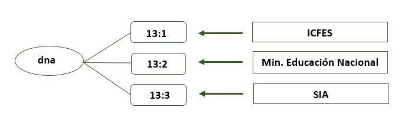
```

La DNA presentó tres requerimientos, y cuenta con esta información, considera la información
suministrada satisface completamente sus necesidades.

```{r, echo=FALSE, out.width='75%', fig.align='center', fig.cap='DNTIC'}
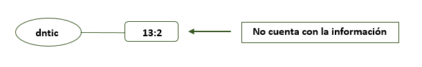
```

La DNTIC presentó el requerimiento 17:1 *“Información del inventario semestral de activos tecnológicos de Hardware y software de la Universidad Nacional”* con el cual no cuenta, de
acuerdo a la información documentadas, se considera que la operación 25:1 *“Indicadores del proceso de Adquisición de Bienes y Servicios”* de la GNFA, podría ser una fuente de información y,
otra posible fuente, sería el registro administrativo 42:1 *“Reporte de Información general técnica, administrativa y jurídica sobre los activos inmobiliarios de la Universidad en el Sistema SIGA (Gestión de bienes)”* también de esta área.

```{r, echo=FALSE, out.width='75%', fig.align='center', fig.cap= 'DNTIC'}

```

Para la DRE, la información suministrada por el SIA para su requerimiento 29:1 *“Registros completos y oportunos de las movilidades efectivas entrantes y salientes”* satisface parcialmente
sus necesidades de información, esto debido a que las sedes, a quienes se les solicita la
información en muchas ocasiones no tienen esta información consolidada.

```{r, echo=FALSE, out.width='75%', fig.align='center', fig.cap='DNPCP'}
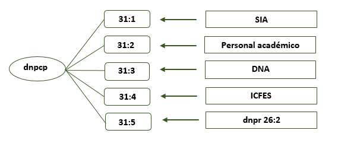
```

Para la DNPCP, la información suministrada para sus requerimientos: *“Registros académicos periódicos – SIA (31:1)”* y *“Registros académicos periódicos – DNA”* (31:3), satisfacen
parcialmente sus necesidades de información. El motivo es que cada usuario no tiene un
identificador entre las diferentes bases de datos, aunque estas son de la misma Universidad. Para
sus otros tres requerimientos la satisfacción con la información suministrada es completa.

```{r, echo=FALSE, out.width='75%', fig.align='center', fig.cap='VRI'}
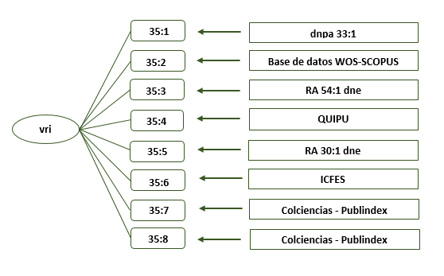
```

La VRI presenta ocho requerimientos de información, seis de ellos tienen un nivel parcial de
satisfacción con la información que les es suministrada. A continuación, se describen estos requerimientos, así como sus motivos de insatisfacción.

1. Base de datos de producción académica, personal docente, comisiones de estudio (35:1),
motivo: La producción académica y el personal docente requiere ser clasificado por áreas
de conocimiento y agendas de conocimiento, categorías que desde el registro
administrativo no se obtienen.

2. Base de datos de producción académica WOS y SCOPUS (35:2), motivo: El registro de la
información no es homogéneo, requiere depuración y normalización de datos.

3. Información de movilidad y avales (35:4), motivo: El registro administrativo no se suministra
oportunamente por parte de las facultades.

4. Base de datos de proyectos de investigación (35:5), motivo: Se requiere normalizar y
clasificar datos.

5. Información de convenios (35:6), motivo: Se requiere mayor información de cada
convenio: Año de suscripción, fecha de inicio, fecha de terminación, país, nombre de la institución, objeto del convenio, sede que coordina, facultad que coordina, profesor que coordina, área de conocimiento y tipo de convenio.

6. Base de datos de grupos de investigación e investigadores (35:8), motivo: La información
procede de una base de datos Oracle de la cual se deben extraer los datos, han codificado
variables y no se tiene acceso a qué corresponden los códigos.

```{r, echo=FALSE, out.width='75%', fig.align='center', fig.cap='DNPR'}
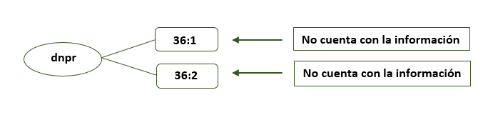
```

La dependencia DNPR tiene dos requerimientos de información *“Valoración de la calidad de losproductos académicos -artículos científicos- producidos por la comunidad Académica de la Universidad (factor de impacto, cuartil, etc.)”* y *“Citas y co-citaciones de artículos científicos producidos por la comunidad Académica de la Universidad”* esta demanda está completamente
insatisfecha, y no fue posible identificar entre las operaciones y registros documentados en el Plan
Estadístico información que pudiera satisfacerla, por ello se hace necesario identificar qué área
podría y tendría la responsabilidad de producirla.

```{r, echo=FALSE, out.width='75%', fig.align='center', fig.cap='GNFA'}
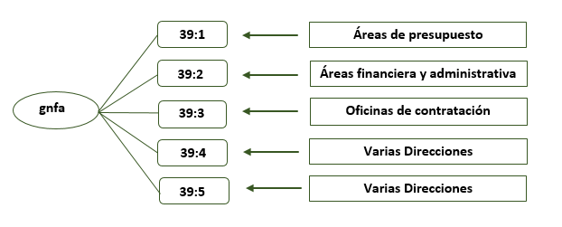
```

En cuatro de los cinco requerimientos reportados por la GNFA, la satisfacción con la información
que les es suministrada por otras áreas o Entidades es completa; para el requerimiento 39:5
*“Implementación del Sistema de Costos de la Universidad Nacional de Colombia”* la satisfacción es
parcial, la razón es que la información remitida por las dependencias requieren un procesamiento
para poder presentar información desagregada por programa curricular.

```{r, echo=FALSE, out.width='60%', fig.align='center', fig.cap='DNPE'}
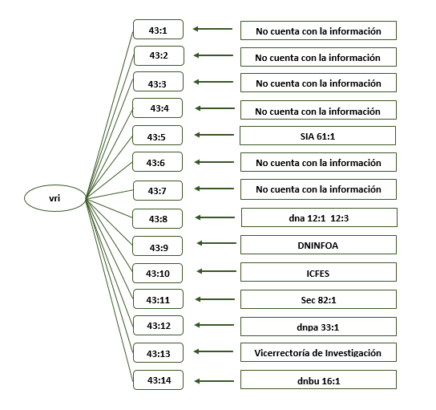
```

La DNPE reporta 14 requerimientos de información, de ellos, dos reportaron tener una
satisfacción parcial con la información recibida, el 43:12 *“Talento humano (Docentes y administrativos)”*, el motivo es que no cuentan con el nivel de formación de los empleados
administrativos. Y el 43:15 *“Bienestar Universitario”*, pero no se reportó el motivo.

Los requerimientos 43:1 *“Movilidad entrante de docentes y administrativos”*, 43:2 *“Indicadores de infraestructura física”*, 43:7 *“Egresados de la Universidad Nacional de Colombia”*, son demandas
insatisfechas de información y no se identificaron operación o registros que pudieran generarla.
Dos posibles fuentes para la producción del requerimiento 43:3, *“Información ambiental”*, son las
operaciones 87:1 y 87:2, *“Consolidado de indicadores ambientales de la Universidad Nacional”* y
*“GREENMETRIC”* del SIGA, ó el registro administrativo 51:4 *“Sistema de Gestión Ambiental - GREENMETRIC”* de la VRG.

El requerimiento 43:4 *“Información de infraestructura tecnológica”* puede tener como fuente el
registro administrativo 34:3 *“Registro de laboratorios y equipos”* de la VRI.

El requerimiento 43:6 puede tener tres posibles fuentes de información, las operaciones 33:1
*“Consolidación de Estadísticas de Personal Académico y Administrativo”*, 12:1 *“Consolidación de información de inscritos y admitidos a los programas curriculares de pregrado semestralmente por la universidad Nacional de Colombia”* y 12:3 *“Consolidación de información de inscritos y admitidos a los programas curriculares de posgrado semestralmente por la universidad Nacional de Colombia”*.

```{r, echo=FALSE, out.width='75%', fig.align='center', fig.cap='OPB'}
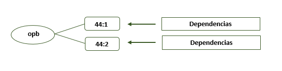
```

Los requerimientos de información de la OPB están completamente satisfechos.

```{r, echo=FALSE, out.width='75%', fig.align='center', fig.cap='DNBU'}
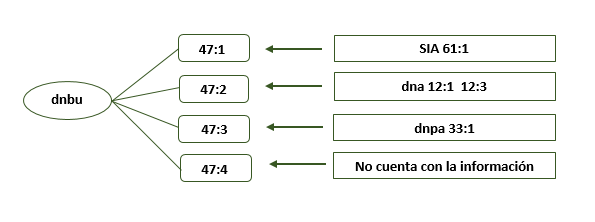
```

Los requerimientos de la DNBU 47:1, 47:2 y 47:3 están completamente satisfechos para el área, en
cuanto al requerimiento 47:4” Información de estudiantes y servidores públicos docentes y
administrativos insatisfecha”, ellos mencionan que no cuentan con toda la información que
necesitan, no fue posible identificar una operación o registro que la produjera.

```{r, echo=FALSE, out.width='75%', fig.align='center', fig.cap='VRG'}
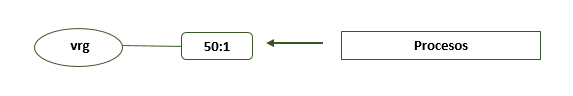
```

El requerimiento de la VRG *“Informe Revisión por la Dirección”* que se alimenta con todos los
procesos de la Universidad, está siendo parciamente satisfecho para sus usuarios, eso debido a
que no siempre envían la información de manera completa y oportuna, por no contar con un
sistema implementado.

```{r, echo=FALSE, out.width='75%', fig.align='center', fig.cap='DNIA'}
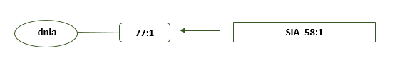
```

El requerimiento de la DNIA está completamente satisfecho.

```{r, echo=FALSE, out.width='75%', fig.align='center', fig.cap='SINAB'}
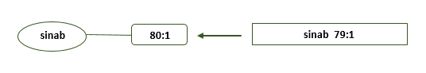
```

El SINAB reporta un requerimiento de información y este se encuentra completamente satisfecho.

```{r, echo=FALSE, out.width='75%', fig.align='center', fig.cap='DJN'}
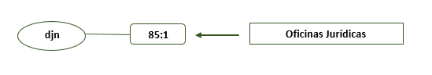
```

El DJN presenta un requerimiento que está completamente satisfecho.

```{r, echo=FALSE, out.width='75%', fig.align='center', fig.cap='PE'}
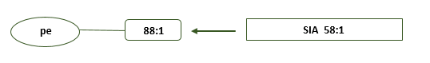
```

El requerimiento del PE está completamente satisfecho.

```{r, echo=FALSE, out.width='75%', fig.align='center', fig.cap='SEC'}
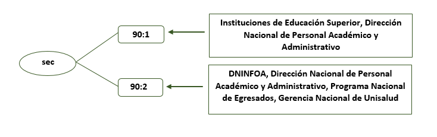
```

Los requerimientos del SEC se encuentran completamente satisfechos.

```{r, echo=FALSE, out.width='75%', fig.align='center', fig.cap='ONCI'}
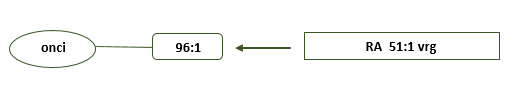
```

La ONCI cuenta con un requerimiento de información que se encuentra completamente
satisfecho.

### Insumo complementario para identificación de necesidades relacionadas con el proceso estadístico

En aras de vincular dentro del diagnóstico y mejoramiento de los procesos estadísticos la
participación de los gestores y generadores de información en cada una de las dependencias
vinculadas en la construcción del Plan Estadístico Institucional, se construyó y aplicó un formato
de encuesta semi -estructurada que buscaba indagar sobre aspectos que no se indagaron en los
formatos de caracterización de ofertas y demandas de información estadística. Los resultados de
la aplicación de dicho instrumento se consolidan en este apartado.

#### Encuesta de percepción sobre el proceso estadístico y el manejo de información estadística

***1. Descripción de los entrevistados:***

Las personas entrevistadas son los funcionarios encargados del manejo de información estadística,
y que fueron delegados para participar en la construcción del Plan Estadístico de la Universidad. En
esta encuesta participaron 31 funcionarios, 20 de planta, 1 provisional y 9 contratistas.

De acuerdo a los niveles de formación indicados en la encuesta, se identificó que 19 de los
funcionarios tienen título de posgrado, 10 pregrado, un tecnólogo, y una persona con título de
secundaria.

Tres funcionarios llevan a cargo de la información estadística menos de 6 meses, otros cinco, entre 6
meses y un año, cuatro funcionarios, entre uno y tres años, nueve funcionarios, de tres a diez años y cuatro funcionarios llevan más de diez años.

En relación a las herramientas que utilizan para la construcción y visualización de la información
estadística, 26 de los funcionarios utiliza Excel, 6 utilizan SQL, 4 Tableau, 3 SPSS y uno utiliza R. 4 de
los funcionarios reportaron utilizar otros programas.

***2. Percepción sobre el proceso estadístico y el manejo de información estadística:***

```{r, echo= FALSE, message=FALSE, warning=FALSE}
library(tidyr)  
library(ggplot2)
bardata_7 <-tibble( 
  calificacion_7=c("Percepción 1", "Percepción 2","Percepción 3"),
  valor_7=c(8,27,23)
)
```
```{r, echo= FALSE, message=FALSE, warning=FALSE, fig.cap='Habilidades y capacitaciones'}
ggplot(bardata_7, aes(x=calificacion_7, y=valor_7, fill=factor(valor_7))) +
  geom_col() +
  scale_fill_brewer(palette= "YlGn") + 
  geom_text(aes(label=valor_7), vjust=0.5, hjust=-0.4, color="black", position = position_dodge(0.8), size=3.5)+
  ylim(0,100)+
  theme(legend.position = "none")+
  ylab("") + xlab("") +
  coord_flip() +
  labs(caption = "Percepción 1: Ha recibido capacitación en temas de gestión de información estadística.\nPercepción 2: Considera necesaria alguna capacitación para mejorar sus competencias en\n manejo y procesamiento de información. \nPercepción 3: En su área o dependencia identifica alguna dificultad o debilidad  para el manejo\ny procesamiento de información.") + scale_x_discrete(limits=c("Percepción 3", "Percepción 2","Percepción 1f"))+
    theme(plot.caption=element_text(size=10, hjust=0, face="italic", color="black"))


```

De los 31 funcionarios entrevistados, 8 han recibido algún tipo de capacitación en gestión  de información estadística, los temas en los que se han capacitado son:

  *	Business Intelligence Analytical
  * Formación en indicadores de gestión
  * Análisis de datos
  * Manejo de SAS

Aún así, 27 de los entrevistados, que corresponden al 87%, consideran que es necesario mejorar las competencias en esta área,  23 de ellos identifican dificultades en este mismo asunto en las áreas o dependencias en las que laboran. Entre las capacitaciones solicitadas, mencionan: Manejo de software (12), producción de estadísticas e indicadores (5), Evaluación de calidad de la información estadística (4), Análisis de datos (3), Gestión de la información (3), Creación y procesamiento de bases de datos (3), Formulación de indicadores (3), Big data (2), Metodologías de análisis estadístico (2), Presentación de resultados estadísticos (2), Acceso a fuentes de información de la UNAL (1) y Business Intelligence (1).

```{r, echo= FALSE, message=FALSE, warning=FALSE}
library(tidyr)  

bardata_8 <-tibble( 
  calificacion_8=c("Percepción 1", "Percepción 2","Percepción 3","Percepción 4","Percepción 5"),
  valor_8=c(12,19,9,28,29)
)
```
```{r, echo= FALSE, message=FALSE, warning=FALSE, fig.cap='Recursos físicos, humanos tecnológicos'}
ggplot(bardata_8, aes(x=calificacion_8, y=valor_8, fill=factor(valor_8))) +
  geom_col() +
  scale_fill_brewer(palette= "YlGn") + 
  geom_text(aes(label=valor_8), vjust=0.5, hjust=-0.4, color="black", position = position_dodge(0.8), size=3.5)+
  ylim(0,100)+
  theme(legend.position = "none")+
  ylab("") + xlab("") +
  coord_flip() +
  labs(caption = "Percepción 1: Considera que el personal de su dependencia es suficiente para atender las\ndemandas de información estadística.\nPercepción 2: Considera que su área o dependencia ha presentado dificuldades para la\nentrega oportuna de la información estadística. \nPercepción 3: Tiene restrincciones para la descarga desde sitios WEB de herramientas para la\ngestión de la información estadística. \nPercepción 4: El equipo del que dispone es adecuado para el manejo de la información. \nPercepción 5: Cuenta con un equipo de cómputo de manera permanente. ") +
  scale_x_discrete(limits=c("Percepción 5","Percepción 4","Percepción 3", "Percepción 2","Percepción 1"))+
    theme(plot.caption=element_text(size=10, hjust=0, face="italic", color="black"))
  


```

Al analizar los recursos con los que se cuenta para el 
manejo de información, se identifica por parte de los funcionarios que los principales inconvenientes son que falta personal para atender las demandas de
información, ya que solo 12 de los 31 consideran que el personal es suficiente. De igual forma, 19 identifican dificultades para la entrega oportuna de información estadística, problema que puede estar
relacionado con el anterior. En cuanto a equipos de cómputo no se observan muchos inconvenientes, 29 cuentan con equipos permanentes y 28 consideran que su equipo es adecuado para el manejo de información. Nueve (9) funcionarios reportaron que tienen restricciones de acceso a páginas web que consideran que son necesarias para la gestión de la información estadística que tienen a cargo.  

***3. Percepción sobre la producción estadística:***

```{r, echo= FALSE, message=FALSE, warning=FALSE}
library(tidyr)  
library(ggplot2)

bardata_9 <-tibble( 
  calificacion_9=c("Percepción 1", "Percepción 2","Percepción 3","Percepción 4","Percepción 5","Percepción 6"),
  valor_9=c(25,20,25,18,8,17)
)
```
```{r, echo= FALSE, message=FALSE, warning=FALSE, fig.cap='Manejo y aprovechamiento de la información producida'}
ggplot(bardata_9, aes(x=calificacion_9, y=valor_9, fill=factor(valor_9))) +
  geom_col() +
  scale_fill_brewer(palette= "YlGn") + 
  geom_text(aes(label=valor_9), vjust=0.5, hjust=-0.4, color="black", position = position_dodge(0.8), size=3.5)+
  ylim(0,100)+
  theme(legend.position = "none")+
  ylab("") + xlab("") +
  coord_flip() +
  labs(caption = "Percepción 1: Considera que la información producida por su dependencia se difunde a todas\nlas dependencias o entidades que la requieren.\nPercepción 2: Antes de difundir la información estadística recolectada y producida por su\ndependencia, se aplica algún procedimiento para verificar la calidad de la información.\nPercepción 3: En su dependencia se adelanta el análisis y verificación de los resultados\nobtenidos. \nPercepción 4: Considera que la producción de información estadística en su dependencia\natiende las condiciones y tiempos previamente definidos. \nPercepción 5: La información estadística que se produce en su dependencia cuenta con una\nmetodología documentada. \nPercepción 6: Considera que la información estadística que se produce en su dependencia\natiende a todos los requerimientos actuales de información. ") +
  scale_x_discrete(limits=c("Percepción 6","Percepción 5","Percepción 4","Percepción 3", "Percepción 2","Percepción 1"))+theme(plot.caption=element_text(size=10, hjust=0, face="italic", color="black"))
  


```

En relación al proceso estadístico desarrollado en las dependencias de la Universidad, desde la perspectiva de los funcionarios, 25 consideran que la información se difunde a los usuarios que la requieren, aunque al preguntarles si consideran que se están atendiendo todos los requerimientos, solo 17 consideran que esto es así. 

En relación a controles de calidad, 20 mencionan que se realizan procedimientos para  verificar la calidad de la información recolectada y producida y 25 que se realiza verificación de los resultados obtenidos, aunque tan solo 8 reportan que se cuenta con metodología documentada. Dieciocho (18) mencionan que la información atiende las condiciones y tiempos definidos.

**Comentarios y sugerencias adicionales de los funcionarios**

Nueve de los funcionarios realizaron comentarios adicionales a lo indagado, la síntesis se presenta a continuación: 

* Consideran que debe existir un funcionario capacitado
  para manejo de información estadística.
  
* Dado que no se tiene información organizada se hace
  dispendioso entregar información a tiempo y luego el
  análisis requerido.

* Desde el proceso de admisiones se obtienen datos,
  cifras que pueden alimentar otras dependencias para
  generar estadísticas.

* El manejo de la información estadística requiere de 
  un enfoque institucional para alinear a toda la 
  dirección de la UNAL con sus dependencias adscritas en
  la forma en que se recolecta y organiza la
  información. 
  
  NOTA: Es importante en la primera construcción no
  mezclar los indicadores de calidad con el tema de 
  estadísticas.

* Es importante poder acceder a la
  información estadística en línea, en tiempo real con
  actualización automática y bajo estándares
  entendibles y accesibles rápidamente.
  
* Es necesario establecer los indicadores básicos lo
  más pronto posible; o por lo menos una metodología  estandarizada y articulada
  con las diferentes facultades, revisión de los que existe. Se debe establecer   un papel más activo a cada una de las facultades, institutos y dependencias;    tener en cuenta sus necesidades básicas de información.
  
* Las bases de datos que están almacenadas muchas veces
  no son compatibles con las sedes o no se comparte con
  las unidades administrativas y se genera duplicidad
  de datos en las bases de la Universidad.
  
* Se requiere que sean muy puntuales para aplicar los
  lineamientos y métodos para la aplicación de la
  información.
  
* Sería importante desde la DNPE establecer lineamientos
  estandarizados para trabajar la planeación 
  estratégica y operativa, así como para la
  documentación y evaluación de indicadores.


