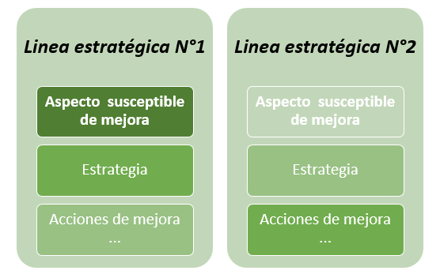

# Formulación del componente estratégico del Plan Estadístico 

En esta apartado se consolidan las propuestas de corto, mediano y largo plazo, que surgen como resultado de  los hallazgos obtenidos del diagnóstico de la información estadística disponible, de la consolidación de requerimientos de información o  demandas insatisfechas de información  y a las necesidades explicitas de funcionarios responsables del manejo de información estadística en sus áreas respectivas.

El conjunto de acciones y recomendaciones orientadas hacia el mejoramiento de los procesos estadísticos internos  se circunscriben en el siguiente Plan de Acción.


## Plan de acción para el fortalecimiento estadístico institucional

Para facilitar la organización, focalización y comprensión de las acciones de mejoramiento consignadas, se proponen dos elementos: en primer lugar, la construcción de una matriz de intervención institucional orientada hacia los procesos estadísticos adoptados  para la generación de información estadística (operaciones estadísticas) y en segundo lugar un conjunto de recomendaciones y acciones que surgen del inventario y revisión de registros administrativos RRAA con potencial uso estadístico.

Dentro de la consolidación de este conjunto de acciones y recomendaciones se consideraron algunos postulados generales, denominados lineamientos orientadores, que  limitan el alcance de las acciones e intervenciones propuestas y de unos principios  rectores de la actividad estadística en la Universidad, que determinan las pautas básicas a seguir en los procesos de consolidación, procesamiento, análisis, difusión y uso de la información estadística institucional. 

### Lineamientos orientadores

* **Lineamiento N°1:** Concreción del concepto de valor público en la construcción de estadísticas institucionales, se refiere a propender  que la generación de estadísticas permita adelantar  la evaluación y seguimiento a los resultados institucionales alcanzados (medibles) para dar respuesta a las necesidades o demandas sociales, resultados asociados a los cambios sociales producidos por la acción institucional  y por las actividades y productos entregados por las diferentes dependencias de la Universidad Nacional (BID, 2015). Puntualmente haciendo de la  información un elemento articulador de las dimensiones del Modelo Integrado de Planeación y Gestión, en la medida que le permiten a la vinculación de la institución y su entorno y le facilita la ejecución de sus operaciones internas. Se hace énfasis en el enfoque transversal de la Información y la comunicación frente a los demás componentes del Modelo, pues permite ampliar y profundizar en el uso y aprovechamiento de la información para los procesos internos de la entidad (toma de decisiones, elaboración de política pública, entre otros), así como la interacción con la comunidad (grupos de valor y grupos de interés).

* **Lineamiento N°2:** Reconocimiento del valor estratégico de la información y promoción del  aprovechamiento de datos, mediante el desarrollo de las condiciones para que los datos generados por diferentes fuentes,  sean gestionados como activos que pueden  generar valor social y económico en cuanto permiten  brindar respuestas efectivas y útiles frente a las necesidades de los diferentes actores institucionales.

* **Lineamiento N°3:** Adopción de las regulaciones y lineamientos del Sistema Estadístico Nacional en lo referente a las fases y caracterización de los  procesos estadísticos institucionales y cuyo objeto es fortalecer la capacidad institucional para producir información de calidad y orientar a las entidades en las actividades requeridas para la generación de estadísticas dependiendo las diferentes fuentes de información (censos, por muestreo o a partir de registros
administrativos).

### Principios para la actividad estadística en la Universidad Nacional de Colombia

Con base en las discusiones y mesas de trabajo realizadas para la formulación del Plan Estadístico de la Universidad Nacional de Colombia, se consideró pertinente adoptar y asumir unos principios básicos para el procesamiento, generación, análisis y difusión de estadísticas, tomando como base los propuestos en otras Entidades, como el Instituto Nacional de Estadística y Geografía de México, y el Sistema Estadístico Nacional. Los siguientes son los principios definidos:

* **Confidencialidad:** Se debe garantizar que los datos obtenidos para la producción de estadísticas de las distintas fuentes, ya sean personas naturales o jurídicas, deben ser estrictamente confidenciales y utilizarse exclusivamente para fines estadísticos.

* **Interpretabilidad:** Para la correcta interpretación de los datos, se debe presentar información referenciada sobre los conceptos, métodos y procedimientos estadísticos utilizados.

* **Pertinencia:** Debe existir una clara relación entre la información estadística producida y los objetivos en los que se enmarca esta.

* **Transparencia:** Condición bajo la cual se pone a disposición de los usuarios, los metadatos que permiten conocer el desarrollo de la operación estadística.

* **Rigurosidad:** Consiste en la aplicación sistemática de los principios, métodos y procedimientos generalmente aceptados por la técnica y la ciencia estadística.

* **Eficiencia:** Es la relación entre el valor de los resultados de la actividad estadística y el costo generado para obtenerlos, teniendo en cuenta el uso adecuado de los recursos disponibles.

* **Oportunidad:** Se refiere al tiempo que transcurre entre la ocurrencia del fenómeno de estudio y la publicación o difusión  de la información estadística, de tal forma que sea útil para la toma de decisiones.

### Estructura de la matriz de intervención

La matriz de intervención es un recurso creado para organizar de manera coherente  las acciones y recomendaciones que propone el Plan Estadístico Institucional, y son usadas en el diagnostico y evaluación.

* **Línea estratégica:** En este componente se establece una asociación  entre las fases del proceso estadístico (Detección  y  análisis  de  requerimientos, Ejecución, Análisis, Difusión)  y la cadena de valor ( insumos, procesos, productos y resultados)utilizada como herramienta principal para representar las intervenciones públicas (DNP, 2015a) o las actividades gubernamentales (OCDE, 2009); la asociación se sintetiza en tres grandes procesos en los que se orienta y soporta la actividad estadística en general: Programación Estadística (¿qué?,¿ cuándo?, ¿quién? y ¿dónde? se produce la información estadística?), producción estadística (¿cómo se produce? y ¿cuáles son lineamientos de Aseguramiento de la calidad estadística  y Regulación estadística?), Usabilidad y aprovechamiento de la información generada  (¿Para qué?) y un cuarto proceso se refiere a las adaptaciones institucionales o capacidades para entronizar en funcionarios y dependencias una visión estratégica de la información estadística institucional este proceso se define como cultura estadística. 

  Con esta organización se busca que se identifiquen y 
  focalicen las intervenciones institucionales en el
  proceso en las cual se presenten sugerencias o
  recomendaciones de mejora y se eviten las
  intervenciones muy generales que pretendan atender
  todas las componentes de la actividad estadística
  simultáneamente.

* **Aspecto susceptible de mejora:** Este componente de la matriz de acción describe el conjunto de hallazgos y elementos que requieren atención en términos de fortalecimiento estadístico. Sintetiza las dificultades u oportunidades de mejora, identificadas con la revisión y análisis de información adelantado en el desarrollo del proyecto, en otros términos, referencia los errores recurrentes en la producción, consolidación, procesamiento y  análisis de información estadística  o que demuestran desconocimiento; además se incluyen los aportes, recomendaciones o solicitudes explicitas consolidadas mediante encuestas y entrevistas con los funcionarios y que evidencian necesidades en materia de producción o gestión de la información estadística en la universidad. 

* **Estrategia:** Se refiere a las líneas generales de Intervención que buscan mejorar la gestión, producción, análisis  y difusión de información estadística de carácter estratégico y que abren paso a una sucesión de acciones que tienen como propósito la consecución de un determinado objetivo.

* **Acciones puntuales de mejora:** Recomendaciones de acción propuestas con base en el conjunto de estrategias definidas. Su importancia radica en la conveniencia  de precisar acciones concretas  que permitan avanzar en la atención oportuna de cada uno de los aspectos susceptibles de mejora.

* **Metas:** Hacen referencia al desempeño esperado en la materialización de cada una de las acciones de fortalecimiento propuestas. Desde esta perspectiva, permite medir el cumplimiento del plan de acción propuesto.

* **Indicador:** En este contexto se refiere a la unidad que permite medir o comparar los resultados efectivamente obtenidos, en la ejecución de cada una de las acciones propuestas en el plan de acción. Permite conocer un “valor” de comparación referido a cada META asociada.

* **Responsable:** Es un componente esencial de la matriz en la medida que se define quien o quienes son los responsables de promover, socializar, implementar y hacer seguimiento de cada una de las acciones de fortalecimiento estadístico propuestas en el Plan de Acción.

* **Tiempo requerido:** Es una dimensión esencial en un Plan de Acción, y en este caso se refiere al periodo definido para la implementación de cada una de las acciones propuestas. 

* **Ámbitos:** Hace referencia al alcance de la intervención o de la acción institucional, en este componente se identifica específicamente  el actor objeto de intervención, es decir, hacia quien debe orientarse las acciones de fortalecimiento estadístico. En ese sentido, se delimitan las acciones enfocadas hacia el individuo, es decir, aquellas que consideran al funcionario como la unidad de intervención e implementación de la acción propuesta; por otro lado, se organizan las acciones que tienen como objeto de intervención cada una de las dependencias que conforman el nivel central de la Universidad Nacional  y que tienen en su haber la producción o utilización de información estadística estratégica; finalmente se conforma un conjunto con las acciones de mejora de carácter general para la Universidad, es decir, aquellas acciones que implican cambios o ajustes a nivel global para garantizar o mejorar la producción estadística en condiciones de calidad, oportunidad y confiabilidad.

* **Priorización:** De acuerdo con la magnitud de la recomendación y la disponibilidad de recursos para asumir su implementación es necesario establecer un orden jerárquico a las acciones propuestas, se propone entonces la siguiente calificación:  alta si el nivel de atención e implementación es imperativo, media si las acciones se pueden implementar de manera progresiva y baja si es posible postergar en alguna medida su implementación o si la no implementación no afecta de manera significativa el proceso de fortalecimiento estadístico.

  Si bien en la matriz, la lectura se debe hacer de 
  forma horizontal, el esquema analítico para la
  formulación de las acciones atiende cierta
  verticalidad, partiendo desde los ejes de
  intervención hasta llegar a la definición de
  responsables y tiempos requeridos para su ejecución.

```{r, echo=FALSE, out.width='75%', fig.align='center', fig.cap='Estructura de la matriz'}

```

Este modelo requiere como complemento a la formulación de las acciones propuestas, la  socialización, validación y aprobación por parte de los responsables de los procesos, con lo cual se busca que los funcionarios delegados de las dependencias y el equipo técnico del proyecto, acuerden para cada acción propuesta los siguientes elementos: metas, tiempo y recursos requeridos para su implementación, responsables en el desarrollo e implementación de las acciones y se define el nivel de importancia o prioridad que se asignaría a cada una. 

Con esta estructura se busca facilitar la comprensión y operacionalización del conjunto de recomendaciones, sugerencias y acciones contenidas en este documento, además, ofrece la posibilidad de  ordenar y priorizar acciones  de acuerdo a las demandas más relevantes en sus procesos de producción y gestión de información estadística.

### Marco conceptual de la matriz de intervención

En este apartado se integran los principales conceptos que orientan la estructura de la matriz y las acciones de intervención propuestas.

#### Planificación estadística

La Planificación Estadística es un proceso técnico, dinámico y permanente que define, organiza y prioriza las estadísticas requeridas para la toma de decisiones[^3]. Facilita la coordinación y regulación de la actividad estadística para optimizar, en un tiempo determinado y con unos recursos establecidos, la gestión, utilidad y aprovechamiento de esta información.

[^3]:@BibEntry2021May

Para el caso particular de la Universidad, la planificación estadística establece el conjunto de procesos necesarios que permiten:  Conocer, diagnosticar y organizar la actividad estadística y establecer lineamientos para su fortalecimiento; Identificar y priorizar la información estadística requerida para la formulación y el diseño de políticas, planes, proyectos;  Determinar las necesidades de información estadística y desarrollar un plan para resolver las necesidades y limitaciones de información;  Contribuir  al uso eficiente de los recursos financieros, tecnológicos y humanos dirigidos hacia la actividad estadística; Facilitar  la toma de decisiones, el seguimiento, monitoreo y evaluación de las políticas, planes y programas institucionales;  Facilitar la articulación entre productores y usuarios fortaleciendo su comunicación y coordinación en cuanto a la producción y el manejo de la información estadística.

En ese sentido el objetivo de las acciones planteadas en este apartado, es: “Promover la definición, organización, priorización y producción de estadísticas institucionales requeridas para la toma de decisiones”.

Como resultados de la revisión de la información estadística identificada y documentada  por los funcionarios en la construcción del Plan Estadístico Institucional, se identificó un conjunto de aspectos  en términos de planificación estadística, susceptibles de mejorar.

#### Aseguramiento de la Calidad Estadística

Es el instrumento mediante el cual se asegura la calidad del proceso estadístico dentro del marco de los “Principios Fundamentales de las Estadísticas Oficiales de Naciones Unidas” y de los criterios de calidad sugeridos por el DANE como pertinentes para cumplir con los requisitos y necesidades de los usuarios, y así contribuir a la credibilidad, confiabilidad y transparencia en la producción de información estadística (DANE, 2015). Establece un conjunto de procedimientos necesarios, orientados a  garantizar que un producto o servicio cumpla con los estándares de calidad de la información.

Acorde con estas premisas, el objetivo de esta sección es adelantar recomendaciones en torno al proceso de producción de información estadística estratégica en la Universidad Nacional, analizando las principales variables que permiten el aseguramiento de su calidad.

El objetivo fundamental de las acciones incluidas en este apartado es:

*“Asegurar la calidad de los procesos estadísticos adelantados por las áreas y dependencias del nivel central de la Universidad Nacional, de acuerdo a los estándares  nacionales e internacionales, de manera que las estadísticas generadas  cuenten con credibilidad, confiabilidad y transparencia en su producción”.*

#### Regulación Estadística

Es un instrumento mediante el cual se adoptan un conjunto de buenas prácticas, normas y estándares estadísticos. Su implementación, permite la armonización, comparabilidad, agregabilidad, calidad e integración de las estadísticas oficiales en el país, dentro del marco de los Principios Fundamentales de las Estadísticas Oficiales de la Organización de las Naciones Unidas (ONU).

La regulación estadística genera las reglas que serán aplicables al conjunto de procesos, procedimientos, métodos y técnicas para el diseño, la recolección, el tratamiento, el análisis, la actualización, la organización, el procesamiento, la integración, la compilación y la conservación de datos e información de carácter estadístico (DANE,2015).

Como resultado de la adopción de los principios de la regulación estadística se espera cumplir con el objetivo fundamental de  mejorar los procesos, procedimientos y métodos utilizados en la elaboración de las estadísticas institucionales;  con estos elementos se fortalece, la comparabilidad, la calidad, la credibilidad y la integridad de las estadísticas que produce la Universidad y se  contribuye a la identificación e implementación de las buenas prácticas y los estándares para la producción estadística.

#### Cultura Estadística

En este eje se incluyen los elementos relacionados  con las prácticas cotidianas en el desarrollo  de actividades de gestión, manejo, producción y difusión de información estadística, tanto de los funcionarios como de las dependencias que componen la Universidad. En particular se refiere a aspectos relacionados con dos componentes interrelacionados:

*  Capacidad para interpretar y evaluar críticamente la
   información estadística, los argumentos apoyados en 
   datos o los fenómenos  que los funcionarios  pueden 
   encontrar en diversos ámbitos de la Universidad.

*   Capacidad para discutir, soportar y difundir sus
    opiniones respecto a tales informaciones 
    estadísticas cuando sea relevante, con argumentos y
    procesos validados que se ven directamente 
    relacionados con:

    * Conocimientos y destrezas de los   componentes
      básicos   conceptual   y  procedimental de la 
      estadística. Según Moreno (1998).
    
    * El  razonamiento  estadístico que incluye  según
      Wild  y  Pfannkuch  (1999) como  componentes 
      fundamentales: 
    
      *  Reconocer la necesidad de los datos.
    
      *  Transnumeración o  la  comprensión  que  puede
         surgir  al  cambiar  la  representación de los
         datos.
    
      *  Percepción de la variación. La recogida
         adecuada de datos y los juicios correctos a
         partir de los  mismos  requieren  la
         comprensión  de  la variación  que  hay  y  se
         transmite en  los datos.
       
      *  *Intuiciones:* Al  enfrentarnos  a  las
         situaciones cotidianas  y  tareas 
         profesionales en que es preciso tomar
         decisiones  basadas  en la evaluación  de
         probabilidades inconscientemente podemos
         suprimir  una  parte de  la  información y
         producir decisiones sesgadas.
    
      *  *Actitudes:* La cultura no es solamente conocimiento y capacidad. La parte emocional–sentimientos, valores, actitudes son también componentes importantes.  

### Síntesis de la matriz de intervención

En este apartado se presentan de manera sintética  los elementos generales consignados en la matriz de intervención.

* **Línea estratégica 1:** Establecer lineamientos conceptuales y metodológicos que orienten la actividad estadística en la Universidad Nacional de Colombia.

  * **Estrategia 1.**  Definir los lineamientos del proceso estadístico para la generación de estadísticas institucionales

    * *Acción 1.* Definir el marco conceptual para 
    indicadores y estadísticas institucionales.
  
    * *Acción 2.* Definir criterios e instrumentos de
    planificación estadística en la priorización de
    estadísticas e indicadores institucionales.
  
    * *Acción 3.* Definir mecanismos adecuados para
    difusión de las estadísticas e indicadores
    institucionales.
    
    * *Acción 4.* Definir procesos estandarizados de
    almacenamiento y procesamiento de la información
    estadística de interés estratégico para la
    Universidad.

  * **Estrategia 2.** Establecer los estándares y nomenclaturas para el desarrollo de la actividad estadística institucional.

    *	*Acción 1.* Definir los estándares y nomenclaturas propios para la actividad estadística institucional.

  * **Estrategia 3.**  Definir lineamientos para el uso de información estadística para seguimiento, monitoreo y evaluación de Planes y Políticas.

    * *Acción 1.* Proponer un modelo soportado en indicadores para seguimiento, monitoreo y evaluación de políticas, planes  y proyectos institucionales.

* **Línea estratégica 2:** Fortalecer los procesos estadísticos para la generación de estadísticas e indicadores de la Universidad Nacional. En esta línea se definen y adaptan los elementos básicos de  Planificación, Calidad y Regulación estadística. 

  * **Estrategia 1.** Adoptar los lineamientos del proceso estadístico para la generación de estadísticas institucionales.

    * *Acción 1.* Implementar mecanismos e instrumentos que faciliten la disposición, organización, almacenamiento, estandarización y control de la información estadística Institucional.

    *	*Acción 2.* Orientar a las dependencias de la Universidad Nacional en las actividades y procesos requeridos para la generación de estadísticas por censos, por muestreo probabilístico o no probabilístico, o a partir de registros administrativos de acuerdo a los lineamientos y estándares definidos.

    *	*Acción 3.* Adoptar los lineamientos conceptuales y metodológicos estandarizada para la generación de información estadística institucional. 

    *	*Acción 4.* Adoptar mecanismos adecuados para difusión de las estadísticas e indicadores generados.

    *	*Acción 5.* Implementar procesos estandarizados de almacenamiento y procesamiento de la información estadística de interés estratégico para la Universidad.

  * **Estrategia 2.**  Mejoramiento de los procesos de planeación  estadística (¿qué?, ¿quién?, ¿dónde?, ¿cuándo?, ¿por qué?).

    *	*Acción 1.* Definición, socialización e implementación de las etapas del proceso estadístico para la generación de estadísticas e indicadores institucionales.

    *	*Acción 2.* Garantizar la continuidad, periodicidad y acceso oportuno a la producción estadística estratégica. 

    *	*Acción 3.* Adoptar criterios de planificación estadística en la priorización de estadísticas e indicadores institucionales.

  * **Estrategia 3.**  Mejoramiento continuo de la calidad de los procesos de producción de información estadística estratégica institucional (¿cómo?).

    *	*Acción 1.* Adelantar la documentación técnica de operaciones estadísticas e indicadores generados por las diferentes dependencias de la Universidad Nacional.

    *	*Acción 2.* Adoptar criterios de calidad estadística en la producción, análisis, interpretación, seguimiento y difusión de la información.

    *	*Acción 3.*  Adecuar  los recursos y el  soporte normativo  en aras de  garantizar la producción continua de las operación estadísticas estratégicas.

    *	*Acción 4.* Evaluar la pertinencia de la información estadística generada, establecer el grado en que la información sirve para hacer frente a los propósitos para los cuales los usuarios (demandantes) buscan esta información.

    *	*Acción 5.* Garantizar Accesibilidad a la información producida por las operaciones estadísticas. La accesibilidad se entiende como la facilidad con la que los usuarios pueden ubicar y acceder a los resultados de una operación estadística. Este atributo de la calidad estadística también se relaciona con la forma en que éstos se suministran y los medios de difusión utilizados.

  * **Estrategia 4.** Fortalecimiento de las capacidades para gestión de información estadística Institucional (énfasis en uso de tecnologías, disposición de recursos y competencias.

    *	*Acción 1.* Adopción de tecnologías y plataformas adecuadas para la producción, procesamiento, análisis y difusión de información estadística estratégica.  

    *	*Acción 2.* Establecer las competencias mínimas requeridas para la gestión de información estadística.

    *	*Acción 3.* Definir un plan de formación y requerimientos mínimos para  consolidación, procesamiento, análisis y difusión de información estadística institucional.

  * **Estrategia 5.** Promover y adoptar estándares y nomenclaturas en el desarrollo de la actividad estadística institucional.

    *	*Acción 1.* Adoptar y/o implementar los lineamientos, conceptos estandarizados, clasificaciones estandarizadas y metodologías para la producción  y difusión.

    *	*Acción 2.* Publicar en los medios institucionales los estándares y nomenclaturas oficiales adoptados en la generación de estadísticas institucionales.

* **Línea estratégica 3:** Promoción de la cultura estadística en la Universidad Nacional.

  * **Estrategia 1.**  Institucionalizar (procesos y procedimientos) en los medios adecuados  los procesos de producción de información estadística estratégica.

    *	*Acción 1.* Documentar todos los procedimientos estadísticos adelantados por las diferentes áreas o dependencias en los mecanismos institucionales pertinentes. 

    *	*Acción 2.* Documentar las metodologías empleadas para  la consolidación, producción, procesamiento, análisis y difusión de la información estadística generada en cada área o dependencia.

    *	*Acción 3.* Asignar de acuerdo a competencias y funciones de las dependencias, las operaciones estadísticas e indicadores estratégicos.

  * **Estrategia 2.** Promover el uso y aprovechamiento de datos, estadísticas e indicadores, como activo estratégico institucional - complementar de acuerdo a las acciones propuestas.

    *	*Acción 1.* Capacitación a responsables de manejo de información estadística en las dependencias  sobre  buenas prácticas estadísticas, estandarización de conceptos y uso de estándares y  nomenclaturas.

    *	*Acción 2.* Fortalecer las capacidades y competencias técnicas en gestión, producción, análisis, procesamiento y difusión de información estratégica de los funcionarios Institucionales  responsables de la producción estadística Institucional.

    *	*Acción 3.* Conocimiento y valoración del potencial estadístico de la información consolidada mediante registros administrativos por las distintas áreas o dependencias.

  * **Estrategia  3.** Promover la difusión de la información estadística institucional.  

    *	*Acción 1.* Definir los canales adecuados para la difusión de la información estadística institucional.
    *	*Acción 2.* Definir características básicas para la difusión de información estadística. 

* **Linea estratégica 4:** Gestionar información estadística para Monitoreo, seguimiento y evaluación.

  * **Estrategia 1.** Generar indicadores para el monitoreo y seguimiento a los resultados institucionales alcanzados (medibles).  

    * *Acción 1.*   Establecer cronograma y responsables de  la producción oportuna y confiable de información estadística estratégica.

    * *Acción 2.* Formalizar los procesos y procedimientos de producción de información estadística estratégica.

  * **Estrategia 2.** Fomentar el uso de la información estadística para evaluación de políticas y planes institucionales.

    *	*Acción 1.* Incorporar las mediciones de indicadores estratégicos para la definición de políticas, planes y programas institucionales. 

    *	*Acción 2.* Identificar registros administrativos con potencial estadístico en la generación de nuevas estadísticas e indicadores. 

    *	*Acción 3.* Definir un mecanismo adecuado que garantice el acceso oportuno de los tomadores de decisiones a  la información estadística  estratégica asociada a planes y políticas institucionales.

    *	*Acción 4.* Incorporar en los escenarios de rendición de cuentas las mediciones de los indicadores estratégicos asociados a los compromisos misionales.

    *	*Acción 5.* Adoptar y adaptar un modelo de seguimiento y evaluación que incorpore indicadores de resultado para el seguimiento y evaluación de las políticas, planes y proyectos institucionales. 


### Fortalecimiento de registros administrativos - RRAA

En este capítulo se consolida un conjunto de recomendaciones y acciones esenciales en la generación de información estadística en la UN, dado que se refieren específicamente a la principal fuente de información usada en las operaciones estadísticas documentadas como son los registros administrativos, específicamente en este capítulo se consolidan y proponen una serie de etapas y acciones orientadas hacia el fortalecimiento y aprovechamiento  de los registros administrativos con potencial estadístico.

El alcance de esta primera etapa,  se limita  a la verificación de requisitos mínimos de cumplimiento en términos de documentación técnica y metodológica,  que permita identificar y filtrar del total de registros reportados por las dependencias aquellos  que pueden ser objeto de fortalecimiento, es decir, la inclusión de lineamientos técnicos, para alcanzar una producción de calidad y un mejor aprovechamiento de la información estadística disponible.

El presente capítulo recopila un conjunto de observaciones generadas de un proceso de revisión del inventario de registros administrativos consolidado y se  destacan los elementos generales de documentación y aspectos susceptibles de mejora por parte de la dependencia encargada, las observaciones derivadas de este proceso permiten un mejor uso y aprovechamiento de la información que consolidan.  

Los registros administrativos sobre los cuales se enfoca el proyecto,  deben estar orientados hacia el cumplimiento de la misionalidad institucional, en tal sentido, no se tuvieron en cuenta dentro de la revisión y análisis RRAA con un enfoque distinto, por ejemplo: registros construidos con el propósito de hacer seguimiento a la gestión interna de cada dependencia o que permiten solamente la verificación de cumplimiento de procesos exclusivos del área; Tampoco se incluyeron en el análisis RRAA consolidados por entidades del orden nacional.

En ese sentido, dentro de los aspectos observados en los registros administrativos caracterizados en el marco del proyecto de formulación del Plan Estadístico se incluyeron los siguientes criterios:

* **Producción propia**

En este criterio se verifico si es la Universidad la que produce el RRAA, es decir, verificar si es una iniciativa institucional: consolidar, almacenar y reportar la información del RRAA o si por el contrario es un requerimiento hacer el reporte en bases de datos de entidades nacionales.

* **Completitud de la ficha del RRAA**

En este criterio se verificó  la completitud  de todos los campos de la ficha técnica del RRAA.

* **Validez de contenido** 

Se verifica si la respuesta consignada en cada campo de la ficha del RRAA guarda correspondencia con la pregunta formulada, si no existe tal correspondencia se define como invalidez del campo.

* **Uso estadístico** 

Uno de los elementos esenciales para verificar el potencial estadístico de los RRAA se refiere al uso potencial de la información recopilada en registro como insumo para la generación de estadísticas institucionales, en ese sentido, el criterio califica la usabilidad de la información consolidada para la construcción de indicadores y/o  estadísticas agregadas.

## Recomendaciones generales 

En algunas dependencias se evidencia poca claridad frente al responsable de consolidar la información recopilada por el registro administrativo. Para que exista un manejo confiable de la información estadística producida en cada dependencia, es necesario definir con claridad sobre quien recae la responsabilidad del manejo de la información, para que sea el responsable del reporte, actualización y seguimiento de la misma. 

En algunos registros administrativos no se identifica demandante o usuario de la información consolidada, ante lo cual es pertinente identificar plenamente quien o que dependencia o área requiere de la información consolidada por el registro administrativo para la definición o seguimiento de las políticas, planes, programas y proyectos que se definen para la Universidad. Es allí donde se considera relevante que exista una articulación entre la información producida por cada entidad acorde al cumplimiento de sus funciones misionales y la demandada por otras para el desarrollo de sus compromisos.

A partir del ejercicio de recolección, caracterización y revisión de los registros administrativos generados, se derivan algunas recomendaciones a tener en cuenta para la producción y consolidación de la información  de los mismos.

* La Universidad, debe disponer los registros
administrativos en un sistema que permita su organización, clasificación y difusión; en este sentido es recomendable hacer una distinción entre los registros administrativos que se producen en función del objeto misional de la Universidad y los que responden a otras necesidades.

* Para la producción de estadísticas a partir de registros administrativos, es conveniente clasificarlos temáticamente a fin de tener organizadas las fuentes de información y facilitar los procesos estadísticos.

*	Revisar continuamente las variables, la documentación asociada, la base de datos y los soportes del proceso de producción del registro administrativo, y mantener actualizado el inventario elaborado en el marco del proyecto.

*	Para estimular la calidad, estandarización, comparabilidad y comprensión del registro administrativo, es importante documentar los siguientes elementos: denominación del registro administrativo, tema al que pertenece, objetivo, marco normativo, unidad de observación, variables, instrumento de recolección, periodicidad, cobertura geográfica y principales usuarios.

*	La documentación de los elementos que componen el registro administrativo deben guardar entre sí coherencia interna, por ejemplo, el nombre, las variables, el objetivo y la unidad de observación deben estar correspondidos de manera lógica sin lugar a contradicciones.

*	Incluir procesos de mejora continua en la producción estadística, entre estos la autoevaluación de los registros administrativos producidos por la Universidad, a partir de requisitos de calidad asociados con la base conceptual y metodológica, las clasificaciones, variables, cobertura alcanzada, calidad de las respuestas, procesamiento de los datos y frecuencia de disponibilidad de los datos.

*	Se recomienda que las dependencias, realicen el procesamiento y análisis de la información recopilada mediante registros administrativos, con el fin de determinar si cuentan con los insumos para satisfacer las necesidades en materia estadística y de esta forma permitir el aprovechamiento de los registros administrativos para fines estadísticos.

*	En aras de optimizar el uso de los recursos disponibles, se recomienda que la infraestructura dispuesta para consolidación y aprovechamiento de los registros administrativos, incluya en principio los RRAA  asociados a una normatividad clara y específica. 

*	Adelantar un proceso de identificación de demandas de información y cruzarlo con la información producida a través de los registros administrativos. Este ejercicio se debe adelantar  tanto dentro de la dependencia que lo produce como para las otras dependencias que podrían eventualmente suplir sus necesidades de información mediante el insumo provisto por los registros administrativos.


